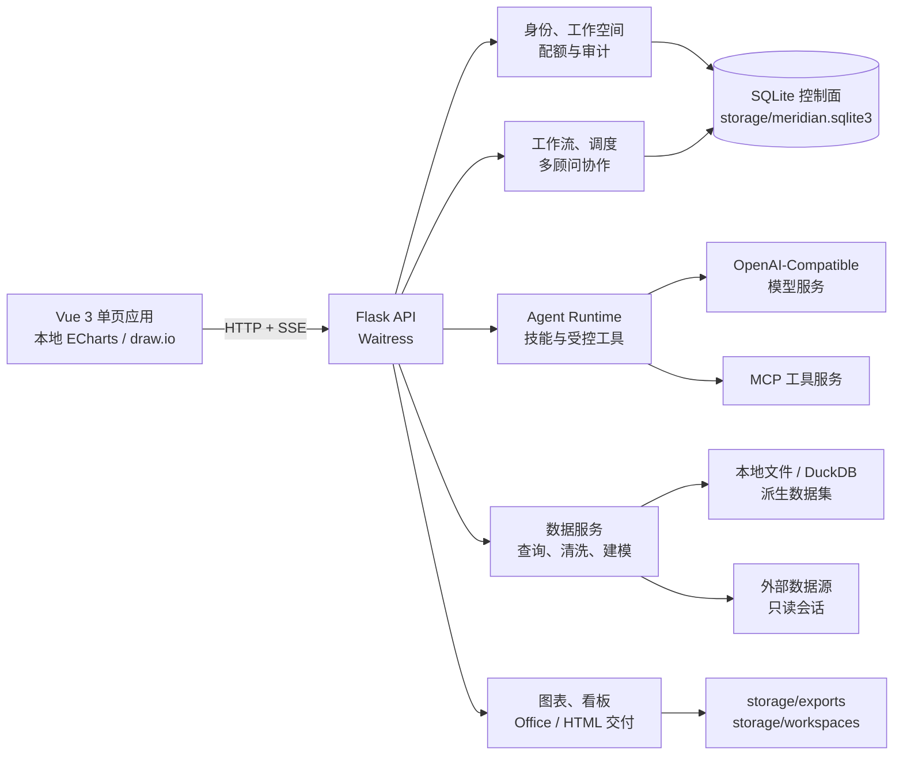

<div align="center">

# 经纬分析工作台

**从数据接入、可复核分析到自动化交付的本地优先企业数据工作空间**

[](https://github.com/fuyuxiang/data-agent/actions/workflows/ci.yml)


[快速开始](#快速开始) · [核心能力](#核心能力) · [系统架构](#系统架构) · [生产部署](#生产部署) · [开发与验证](#开发与验证) · [安全边界](#安全边界)

</div>

---

经纬分析工作台（Meridian Analytics Workbench）是一套 Vue 3 + Python 的一体化数据分析系统。它将数据目录、只读 SQL、统计建模、自然语言 Agent、业务知识、多顾问协作、审批工作流、分析看板和 Office 交付统一到同一个可治理工作空间中。

项目面向需要“把问题变成数据证据，再把证据变成可交付结果”的分析团队。数据、中间结果、知识索引、审计记录与导出文件默认保存在本机 `storage/`；模型和外部工具按需连接，没有配置模型密钥时仍可使用确定性本地规划器完成基础查询与分析。

## 核心能力

| 能力域 | 已实现能力 |
| --- | --- |
| 对话式分析 | 基于当前会话数据源执行 schema 检查、只读查询、统计分析、图表生成和成果导出；通过 SSE 实时展示规划、工具调用和运行阶段 |
| 数据目录 | 上传 CSV、TSV、Excel、JSON/JSON Lines、Parquet；连接 SQLite、PostgreSQL、MySQL、SQL Server、HTTP JSON、Google Sheets 和飞书多维表格 |
| 数据处理 | 数据预览、质量画像、缺失/重复/异常检查、文本规整、缺失填充、缩尾和派生数据集；清洗不覆盖原始数据 |
| 统计与建模 | 相关分析、十分位分层、K-Means、A/B 检验、线性/逻辑回归、决策树、随机森林、梯度提升、特征筛选、异常检测以及 ARIMA、SARIMA、VAR、Prophet 风格和神经网络预测 |
| 知识与记忆 | 导入 TXT、Markdown、HTML、CSV、JSON、PDF、Word 和 Excel 知识文档；管理指标口径、业务规则、背景知识、会话临时指令和长期记忆 |
| 自动化与协作 | 版本化工作流、依赖图、并行 Agent 节点、人工审批、重试、调度、生命周期 Hook、后台任务、多顾问团队和证据复核 |
| 可视化与交付 | 本地 ECharts 图表、可刷新看板、独立 HTML 看板、draw.io 决策地图，以及 CSV、XLSX、DOCX、PPTX 成果 |
| 开放集成 | OpenAI-Compatible 模型；Streamable HTTP、SSE、HTTP 和受控 stdio MCP；Webhook、飞书、钉钉、Slack 和 SMTP 通知 |
| 计算资源 | 本机 CPU/CUDA/Ollama 检测；通过 HTTPS 或需人工核验主机指纹的 SSH 隧道连接远程 OpenAI-Compatible 推理服务 |
| 企业治理 | 工作空间隔离、owner/editor/viewer 权限、邀请入组、会话与 CSRF 保护、凭据加密、审计日志、容量/超时/配额边界、归档恢复与加密备份 |

## 一次完整的分析如何发生

1. 在“数据目录”上传文件或登记外部数据源，预览表结构并检查数据质量。
2. 将数据源加入当前会话；Agent 只能看到本会话明确授权的数据。
3. 用自然语言提问，或在 SQL 控制台直接执行单条只读查询。
4. 运行数据画像、统计检验、机器学习或时间序列模型，保留查询与工具调用证据。
5. 生成图表、决策画布或看板，亦可把流程固化为带审批的自动化任务。
6. 导出数据、Word 报告、PowerPoint 演示文稿或独立 HTML 看板。

## 快速开始

### 环境要求

- Python 3.10 或更高版本（CI 使用 Python 3.11）
- Git
- Node.js 20+ 仅在前端检查或生产构建时需要
- Docker + Docker Compose 仅在容器部署时需要

> [!NOTE]
> SQL Server 连接需要系统已安装 Microsoft ODBC Driver 18。项目的 Docker 镜像已自动安装该驱动。

### 桌面脚本启动

克隆项目后，macOS 双击 `start.command`，Windows 双击 `start.bat`。脚本会检查 Python 版本、创建 `.venv`、按哈希锁定文件安装依赖，并在 `http://127.0.0.1:5001` 启动服务。

macOS/Linux 也可以从终端运行：

```bash
./start.command
```

### 手动启动

macOS/Linux：

```bash
git clone https://github.com/fuyuxiang/data-agent.git
cd data-agent
python3 -m venv .venv
source .venv/bin/activate
python -m pip install --require-hashes -r requirements.lock
python app.py
```

Windows PowerShell：

```powershell
git clone https://github.com/fuyuxiang/data-agent.git
Set-Location data-agent
py -3 -m venv .venv
& .\.venv\Scripts\Activate.ps1
python -m pip install --require-hashes -r requirements.lock
python app.py
```

启动后访问 <http://127.0.0.1:5001>。开发环境中，全新实例默认进入无账号的本地模式；生产环境会要求先创建第一位系统所有者，密码至少 12 位。

### 可选：安装为用户级命令

仓库提供用户级安装脚本。脚本会将项目克隆或快进更新到独立目录、重建虚拟环境并生成启动命令。两端都可通过 `MERIDIAN_REPOSITORY` 和 `MERIDIAN_INSTALL_ROOT` 调整来源与项目位置；macOS/Linux 还支持 `MERIDIAN_LAUNCHER_ROOT`。

```bash
./install.sh
~/.local/bin/meridian-analytics
```

Windows PowerShell：

```powershell
.\install.ps1
& "$HOME\meridian-analytics.bat"
```

### 首次使用

1. 在“数据目录”上传自有数据，或使用 [`deploy/samples/Sample-data.xlsx`](deploy/samples/Sample-data.xlsx) 快速体验。
2. 勾选“用于当前会话”，回到“分析会话”直接提问。
3. 如需模型规划，在“系统设置 → 模型服务”添加 OpenAI-Compatible 配置，并使用界面中的“测试”按钮做真实请求验收。
4. 在“业务知识”补充指标口径和业务规则，减少模糊解读。
5. 将高频分析固化为工作流，将查询图表组织为看板，或导出为可交付文件。

### 可选：深度学习能力

基础依赖不强制安装 PyTorch。需要 Torch MLP 或 GRU 时，请根据本机 CPU/CUDA 环境选择合适的 PyTorch wheel，然后安装：

```bash
python -m pip install -r requirements-dl.txt
```

## 系统架构



### 技术栈

- **Web 客户端：** Vue 3 Global Build + 原生 ES Modules，ECharts、Marked、DOMPurify 和 draw.io 资产全部随项目本地交付，无运行时 CDN 依赖。
- **API 与运行时：** Flask + Waitress，按业务域拆分 Blueprint；对话运行时通过 SSE 流式返回进度和结果。
- **数据与计算：** pandas、DuckDB、SQLAlchemy、SciPy、scikit-learn、statsmodels、pmdarima；PyTorch 为可选能力。
- **元数据库：** 单机 SQLite WAL，保存用户、工作空间、会话、配置、任务、血缘和审计记录。
- **交付：** openpyxl、python-docx、python-pptx 与自包含 HTML 看板。

### 核心目录

```text
.
├── app.py                       # 应用入口；默认使用 Waitress
├── backend/
│   ├── api/                     # HTTP/SSE 接口与边界校验
│   ├── core/                    # 配置、SQLite 存储、观测性和实例锁
│   ├── services/                # Agent、数据、模型、工作流、MCP 与交付服务
│   ├── analysis_modules/        # 统计、机器学习与时序分析实现
│   ├── data_cleaning/           # 可追溯的数据处理能力
│   └── document_output/         # Excel、Word 与 PowerPoint 交付
├── frontend/                    # Vue 应用、本地依赖和 draw.io 资产
├── skills/                      # 28 个内置分析/交付技能 SOP
├── scripts/                     # 前端构建、依赖验证、备份与恢复
├── packaging/                   # 经密钥扫描的 PyInstaller 桌面打包
├── tests/                       # API、安全、自动化、兼容性与打包测试
├── storage/                     # 本地运行数据（不纳入 Git）
├── Dockerfile / compose.yaml    # 单节点生产部署
└── railway.json                 # Railway Dockerfile 部署配置
```

## 配置

完整模板见 [`.env.example`](.env.example)。本机开发可以使用默认值；生产环境必须显式注入密钥和信任边界。

> [!IMPORTANT]
> `app.py` 不会自动加载 `.env` 文件。Docker Compose 会自动读取项目根目录的 `.env`；直接在主机运行时，请通过 Shell、进程管理器或密钥管理服务注入环境变量。

| 变量 | 默认值 | 说明 |
| --- | --- | --- |
| `MERIDIAN_ENV` | `development` | `development` / `production` / `test` |
| `MERIDIAN_HOST` / `MERIDIAN_PORT` | `127.0.0.1` / `5001` | HTTP 监听地址与端口 |
| `MERIDIAN_STORAGE_DIR` | `./storage` | SQLite、上传文件、知识、交付物和回收站根目录 |
| `MERIDIAN_SECRET_KEY` | 开发环境自动生成 | 会话签名密钥；生产环境至少 32 字符 |
| `MERIDIAN_ENCRYPTION_KEY` | 开发环境复用会话密钥 | 外部凭据静态加密密钥；生产必须独立持久化 |
| `MERIDIAN_BACKUP_KEY` | 空 | 备份加密密钥；生产必须与前两个密钥不同 |
| `MERIDIAN_TRUSTED_HOSTS` | 空 | 允许访问应用的 Host；生产必填 |
| `MERIDIAN_ALLOWED_ORIGINS` | 本机开发地址 | 允许携带凭据调用 API 的 Origin |
| `MERIDIAN_OUTBOUND_HOST_ALLOWLIST` | 空 | 模型、MCP、HTTP 数据源、Webhook 等出站目标域名；生产必填 |
| `MERIDIAN_DATABASE_HOST_ALLOWLIST` | 空 | 允许登记的外部数据库域名 |
| `MERIDIAN_ALLOW_PRIVATE_NETWORK` | `0` | 是否允许一般 HTTP 出站访问内网地址 |
| `MERIDIAN_DATABASE_ALLOW_PRIVATE_NETWORK` | `0` | 是否允许数据库连接访问内网地址 |
| `MERIDIAN_COOKIE_SECURE` | 生产为 `1` | 仅允许在 HTTPS 上发送会话 Cookie |
| `MERIDIAN_MAX_UPLOAD_MB` | `100` | 单次上传大小上限 |
| `MERIDIAN_MAX_QUERY_ROWS` | `10000` | 服务端查询结果行上限 |
| `MERIDIAN_QUERY_TIMEOUT_SECONDS` | `30` | 外部数据库查询超时 |
| `MERIDIAN_DAILY_TOKEN_LIMIT` | `1000000` | 每工作空间每日模型 token 配额 |
| `OPENAI_API_KEY` / `OPENAI_BASE_URL` / `OPENAI_MODEL` | 参见模板 | 可选的环境级 OpenAI-Compatible 默认服务 |

与资源边界相关的行数、单元格数、分析规模、Agent 迭代、任务队列、会话时长、SMTP 和嵌入模型变量，请直接查看 [`.env.example`](.env.example)。

## 生产部署

### Docker Compose

`compose.yaml` 使用只读根文件系统、独立数据卷、`tmpfs`、非 root 用户、capability 删除、资源限制和日志轮转。启动前至少配置以下环境变量：

```bash
export MERIDIAN_SECRET_KEY="$(openssl rand -hex 32)"
export MERIDIAN_ENCRYPTION_KEY="$(openssl rand -hex 32)"
export MERIDIAN_BACKUP_KEY="$(openssl rand -hex 32)"
export MERIDIAN_TRUSTED_HOSTS="analytics.example.com"
export MERIDIAN_ALLOWED_ORIGINS="https://analytics.example.com"
export MERIDIAN_OUTBOUND_HOST_ALLOWLIST="api.openai.com"

docker compose up --build -d
docker compose ps
curl --fail http://127.0.0.1:5001/api/ready
```

Compose 默认只将服务映射到主机 `127.0.0.1`。请在前方配置 HTTPS 反向代理，并将对外域名精确写入 `MERIDIAN_TRUSTED_HOSTS` 和 `MERIDIAN_ALLOWED_ORIGINS`。所有实际使用的模型、MCP、HTTP 数据源和通知服务域名都应纳入出站白名单。

### 主机部署

非容器生产部署需先构建前端，并将 `MERIDIAN_FRONTEND_DIR` 指向构建产物：

```bash
npm run check
npm run build

export MERIDIAN_ENV=production
export MERIDIAN_FRONTEND_DIR="$PWD/frontend/dist"
# 继续注入上文所列的密钥、Host、Origin 和出站白名单
python app.py
```

`app.py` 在非 debug 模式下使用 Waitress。生产环境禁止启用 `MERIDIAN_DEBUG=1`，且会拒绝不完整的前端产物或弱密钥配置。

### Railway

根目录的 [`railway.json`](railway.json) 会使用 [`Dockerfile`](Dockerfile) 构建，并以 `/api/ready` 作为就绪检查。除上述生产变量外，Railway 环境会强制新用户验证邮箱，因此还应配置 `SMTP_HOST`、`SMTP_PORT`、`SMTP_USERNAME`、`SMTP_PASSWORD` 和 `SMTP_FROM`。

### 运行边界

> [!WARNING]
> 当前生产形态是**单节点**：控制面使用 SQLite，进程会对 `storage/.instance.lock` 加独占锁。不要将多个应用副本指向同一个 `storage` 卷。如需多副本高可用，必须先将控制面、任务队列和文件存储迁移到可共享的外部服务。

### 健康检查

- `GET /api/health`：进程与数据库基础健康状态。
- `GET /api/ready`：数据库可用性、存储可写性与调度器状态；不就绪时返回 HTTP 503。

## 备份与恢复

备份工具会使用 SQLite Online Backup API 创建一致性快照，连同上传文件、知识和交付物归档；设置 `MERIDIAN_BACKUP_KEY` 后使用 AES-GCM 加密并输出 SHA-256。

```bash
export MERIDIAN_BACKUP_KEY="<与应用密钥分离保管的至少-32-字符密钥>"
python scripts/backup.py --storage storage
```

恢复时应先停止应用，将备份验证并解包到一个**空目录**：

```bash
python scripts/restore.py storage/backups/meridian-YYYYMMDDTHHMMSSZ.tar.gz.enc \
  --destination /path/to/empty-restore-root \
  --sha256 <backup-sha256>
```

恢复命令会拒绝路径越界、链接或非法归档成员，并对数据库执行 `PRAGMA integrity_check`。验证通过后，再由运维流程将 `<destination>/storage` 替换为实际数据目录。

## 桌面打包

项目支持生成 PyInstaller onedir 桌面包。打包前会只将允许的源码树复制到 staging 目录，拒绝符号链接、数据库、`.env` 和可识别的私钥/API Key。

```bash
python -m pip install -r requirements-dev.txt -r packaging/requirements.txt
./packaging/build_desktop.sh
```

Windows 使用：

```powershell
python -m pip install -r requirements-dev.txt -r packaging/requirements.txt
.\packaging\build_desktop.ps1
```

产物输出到 `build/desktop/dist/`。桌面应用启动本机 Waitress 服务并自动打开浏览器；用户数据保存在操作系统的标准应用数据目录。

## 开发与验证

### 安装开发依赖

```bash
python3 -m venv .venv
source .venv/bin/activate
python -m pip install -r requirements-dev.txt
```

### 后端质量检查

```bash
ruff check backend scripts packaging tests app.py meridian_remote_runner.py
ruff check --select S backend scripts packaging app.py meridian_remote_runner.py
python -m compileall -q backend scripts packaging app.py meridian_remote_runner.py
pytest -q
```

### 前端检查与构建

```bash
npm run check
npm run build
```

`npm run check` 会验证本地前端依赖完整性和 JavaScript 语法；`npm run build` 会生成不包含开发时动态模板编译器的 `frontend/dist/` 生产静态资产。完整产品仍需要 Python API 服务。

### 集成测试

PostgreSQL 和 MySQL 连接器测试需要临时数据库，环境变量与执行方式可参考 [`.github/workflows/ci.yml`](.github/workflows/ci.yml)。CI 还会执行覆盖率门槛、锁定依赖安全审计、Compose 配置校验和生产镜像构建。

## 安全边界

系统将“分析可用”和“默认安全”同时作为设计约束：

- **SQL 只读：** 使用 sqlglot 解析单条 `SELECT` / `WITH` / 集合查询，禁止 DDL/DML、外部文件/网络函数和多语句；同时在数据库会话层启用只读事务、超时和行数上限。
- **数据不覆盖：** 清洗结果作为新派生数据集保存；常规删除进入可恢复的归档/回收站，永久删除需显式确认。
- **秘密保护：** 模型、数据源、MCP、通知和 SSH 凭据使用应用主密钥加密落库，API 只返回脱敏状态。
- **出站防护：** 外部 HTTP 请求校验 scheme、域名白名单和解析后 IP，默认禁止本机、内网、链路本地与保留地址，并限制重定向和响应体大小。
- **身份与隔离：** 生产环境强制登录，工作空间成员和敏感配置操作按角色授权；写请求受 Origin 和 CSRF 校验保护。
- **受控执行：** stdio MCP 默认关闭；命令 Hook 仅允许显式白名单；远程 SSH 首次连接必须由用户确认主机指纹。
- **可追溯：** 查询、分析、工具调用、工作流、快照恢复和交付动作保留审计证据。

安全控制不代替部署环境的 TLS、网络分区、最小权限数据库账号、密钥托管、异地备份和安全监控。生产上线前应根据组织的数据分类分级和合规要求完成独立评审。

## 数据与许可说明

- `storage/`、`.env`、本地数据库、日志和构建产物已通过 `.gitignore` 排除；请勿将真实数据、密钥或备份提交到 Git。
- 依赖版本由 `requirements.lock` 以哈希锁定，生产镜像使用 `--require-hashes` 安装。
- 当前仓库**没有项目级 `LICENSE`**，且部分分析、清洗、文档交付与 Skill 实现受 CC BY-NC 4.0 等第三方条款约束。在企业内部商用、SaaS、分发或二次销售前，必须先完成权利审核并取得必要授权。详见 [`THIRD_PARTY_NOTICES.md`](THIRD_PARTY_NOTICES.md)。

---

<div align="center">

**Meridian Analytics Workbench · 让每一个结论都能回到数据，让每一次分析都能沉淀为流程。**

</div>
