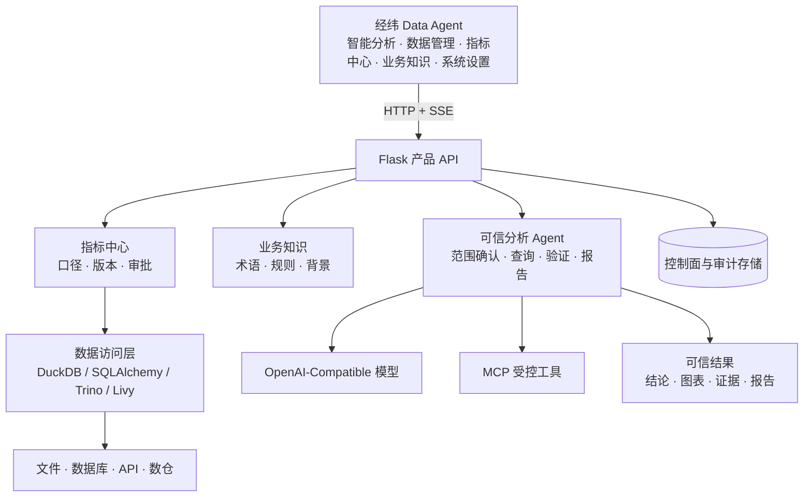

<div align="center">

# 经纬 Data Agent

**面向业务人员的可治理、可追溯、可持续运营的企业级数据智能产品**

[](https://github.com/fuyuxiang/data-agent/actions/workflows/ci.yml)


[快速开始](#快速开始) · [核心能力](#核心能力) · [系统架构](#系统架构) · [生产部署](#生产部署) · [开发与验证](#开发与验证) · [安全边界](#安全边界)

</div>

---

经纬 Data Agent 是一套 Vue 3 + Python 的企业数据分析 Agent。产品只围绕“接入数据 → 治理指标与知识 → 发起分析 → 生成报告”这条主链路展开；数据库、文件、API 和数仓是受治理的数据源，MCP 是 Agent 的受控工具连接。

产品以业务分析人员为主要用户：业务用户进入后直接提问，系统自动完成意图澄清、查询、分析、验证和报告生成；管理员只在需要时进入数据管理、指标中心、业务知识和系统设置。当前产品边界与删减原则见 [PRODUCT_SCOPE.md](PRODUCT_SCOPE.md)。

数据、中间结果、知识索引、审计记录与导出文件默认保存在本机 `storage/`；模型和外部工具按需连接。没有模型配置时，数据浏览和确定性指标查询仍可用，正式自主分析则明确返回 `model_not_configured`，不会伪造结果。

## 核心能力

| 模块 | 核心职责 |
| --- | --- |
| 智能分析 | 自然语言提问、意图澄清、分析过程、图表、证据、追问、反馈和报告导出 |
| 数据管理 | 文件/数据库/API 接入、结构预览、质量检查、加工和访问权限 |
| 指标中心 | 语义模型、原子/派生/复合指标、口径版本、负责人和审批发布 |
| 业务知识 | 文档导入、指标解释、业务规则、背景知识及检索测试 |
| 系统设置 | 成员与角色、模型连接、MCP 工具连接和审计日志 |

## 一次完整的分析如何发生

1. 管理员在“数据管理”接入数据库、文件、API 或数仓，完成结构预览、质量检查和访问控制。
2. 管理员在“指标中心”和“业务知识”发布可信口径与业务规则。
3. 业务用户进入“智能分析”直接提问；复杂问题先确认理解，再由 Agent 查询、分析并验证。
4. 结果在同一页面呈现结论、图表、证据和分析过程，并可继续追问或导出报告。

## 快速开始

### 环境要求

- Python 3.10 或更高版本（CI 使用 Python 3.11）
- Git
- Node.js 20+ 仅在前端检查或生产构建时需要
- Docker + Docker Compose 仅在容器部署时需要

> [!NOTE]
> SQL Server 连接需要系统已安装 Microsoft ODBC Driver 18。项目的 Docker 镜像已自动安装该驱动。

### 本地 Web 启动

macOS/Linux：

```bash
git clone https://github.com/fuyuxiang/data-agent.git
cd data-agent
python3 -m venv .venv
source .venv/bin/activate
python -m pip install --require-hashes -r requirements.lock
python app.py
```

Windows PowerShell：

```powershell
git clone https://github.com/fuyuxiang/data-agent.git
Set-Location data-agent
py -3 -m venv .venv
& .\.venv\Scripts\Activate.ps1
python -m pip install --require-hashes -r requirements.lock
python app.py
```

启动后访问 <http://127.0.0.1:5001>。开发环境中，全新实例默认进入无账号的本地模式；生产环境会要求先创建第一位系统所有者，密码至少 12 位。

### 首次使用

系统的正确使用顺序是：

1. **配置模型：** 工作空间所有者进入“系统设置 → 模型服务”，填写 API Key、Base URL 和模型 ID，测试成功后再进行自主分析。
2. **接入数据：** 在“数据管理”上传文件或连接数据库；检查预览结果，并勾选允许 Agent 使用的数据源和数据库表。
3. **定义指标：** 在“指标中心”建立语义模型，定义指标名称、聚合方式、维度和业务口径，测试后审批发布。
4. **补充知识：** 在“业务知识”维护术语、同义词、业务规则和分析背景，避免 Agent 只理解字段、不理解业务。
5. **发起分析：** 回到“智能分析”，选择本次会话的数据源，用业务语言描述问题；复杂任务先核对统计范围，再确认执行。
6. **核验证据：** 查看 Agent 的查询、分析过程、指标口径、数据范围和验证状态；有歧义时继续追问或修改范围。
7. **生成报告：** 在同一分析页面导出 Word、PPT、Excel 或其他支持的交付物。
8. **维护权限：** 在数据源“访问权限”和“系统设置 → 成员与权限”中控制谁可以查看、分析和管理数据。

首次体验可在“数据管理”点击“载入演示数据”。系统会幂等创建一套即时零售 10 城经营样例，同时生成对应的正式指标、业务知识和推荐问题，并自动加入当前分析会话；重复点击不会产生重复数据。

### 可选：深度学习能力

基础依赖不强制安装 PyTorch。需要 Torch MLP 或 GRU 时，请根据本机 CPU/CUDA 环境选择合适的 PyTorch wheel，然后安装：

```bash
python -m pip install -r requirements-dl.txt
```

## 系统架构



### 技术栈

- **Web 客户端：** Vue 3 Global Build + 原生 ES Modules，ECharts、Marked 和 DOMPurify 随项目本地交付，无运行时 CDN 依赖。
- **API 与运行时：** Flask + Waitress；正式分析由独立 Run/Contract/Plan/Action/Event API 驱动，SSE 可重连补事件。
- **数据与计算：** pandas、DuckDB、SQLAlchemy、SciPy、scikit-learn、statsmodels、pmdarima；PyTorch 为可选能力。
- **元数据库：** 单机 SQLite WAL，保存用户、工作空间、会话、配置、任务、血缘和审计记录。
- **交付：** openpyxl、python-docx、python-pptx 与自包含 HTML 看板。

### 核心目录

```text
.
├── app.py                       # 应用入口；默认使用 Waitress
├── backend/
│   ├── api/                     # HTTP/SSE 接口与边界校验
│   ├── core/                    # 配置、SQLite 存储、观测性和实例锁
│   ├── agent/                   # 唯一模型协议、AgentLoop、RunStore 与 ToolExecutor
│   ├── services/                # 数据面、验证、结果、工作流、MCP 与交付服务
│   ├── analysis_modules/        # 统计、机器学习与时序分析实现
│   ├── data_cleaning/           # 可追溯的数据处理能力
│   └── document_output/         # Excel、Word 与 PowerPoint 交付
├── frontend/                    # Vue 应用与必要本地依赖
├── skills/                      # 28 个内置分析/交付技能 SOP
├── scripts/                     # 构建、验收、仓库审计、备份与恢复
├── deploy/warehouse/            # 固定版本的 Trino/Iceberg/Spark-Livy 参考环境
├── tests/                       # API、安全、自动化与产品化测试
├── storage/                     # 本地运行数据（不纳入 Git）
├── Dockerfile / compose.yaml    # 单节点生产部署
└── railway.json                 # Railway Dockerfile 部署配置
```

## 配置

完整模板见 [`.env.example`](.env.example)。本机开发可以使用默认值；生产环境必须显式注入密钥和信任边界。

> [!IMPORTANT]
> `app.py` 不会自动加载 `.env` 文件。Docker Compose 会自动读取项目根目录的 `.env`；直接在主机运行时，请通过 Shell、进程管理器或密钥管理服务注入环境变量。

| 变量 | 默认值 | 说明 |
| --- | --- | --- |
| `MERIDIAN_ENV` | `development` | `development` / `production` / `test` |
| `MERIDIAN_HOST` / `MERIDIAN_PORT` | `127.0.0.1` / `5001` | HTTP 监听地址与端口 |
| `MERIDIAN_STORAGE_DIR` | `./storage` | SQLite、上传文件、知识、交付物和回收站根目录 |
| `MERIDIAN_SECRET_KEY` | 开发环境自动生成 | 会话签名密钥；生产环境至少 32 字符 |
| `MERIDIAN_ENCRYPTION_KEY` | 开发环境复用会话密钥 | 外部凭据静态加密密钥；生产必须独立持久化 |
| `MERIDIAN_BACKUP_KEY` | 空 | 备份加密密钥；生产必须与前两个密钥不同 |
| `MERIDIAN_BOOTSTRAP_TOKEN` | 空 | 生产首位系统所有者的一次性初始化令牌，至少 32 字符 |
| `MERIDIAN_METRICS_TOKEN` | 空 | Prometheus `/api/metrics` Bearer Token；生产必须至少 32 字符 |
| `MERIDIAN_TRUSTED_HOSTS` | 空 | 允许访问应用的 Host；生产必填 |
| `MERIDIAN_ALLOWED_ORIGINS` | 本机开发地址 | 允许携带凭据调用 API 的 Origin |
| `MERIDIAN_OUTBOUND_HOST_ALLOWLIST` | 空 | 模型、MCP、HTTP 数据源、Webhook 等出站目标域名；生产必填 |
| `MERIDIAN_DATABASE_HOST_ALLOWLIST` | 空 | 允许登记的外部数据库域名 |
| `MERIDIAN_ALLOW_PRIVATE_NETWORK` | `0` | 是否允许一般 HTTP 出站访问内网地址 |
| `MERIDIAN_DATABASE_ALLOW_PRIVATE_NETWORK` | 开发 `1` / 生产 `0` | 是否允许数据库连接访问本机或内网地址；可用 `0`/`1` 显式覆盖 |
| `MERIDIAN_COOKIE_SECURE` | 生产为 `1` | 仅允许在 HTTPS 上发送会话 Cookie |
| `MERIDIAN_MAX_UPLOAD_MB` | `100` | 单次上传大小上限 |
| `MERIDIAN_MAX_QUERY_ROWS` | `10000` | 服务端查询结果行上限 |
| `MERIDIAN_MAX_QUERY_MB` | `20` | 单次查询物化结果的编码/内存字节上限（MB） |
| `MERIDIAN_MAX_QUERY_CELL_KB` | `1024` | 单个字符串或二进制结果单元格上限（KB） |
| `MERIDIAN_QUERY_TIMEOUT_SECONDS` | `30` | 外部数据库查询超时 |
| `MERIDIAN_DAILY_TOKEN_LIMIT` | `5000000` | 每工作空间每日模型 token 配额 |
| `MERIDIAN_SANDBOX_IMAGE` | `meridian-sandbox:py311-20260906` | 固定的有界 Python 执行镜像；禁止 `latest` |
| `MERIDIAN_SANDBOX_PROXY_TOKEN` | 空 | Web 与宿主 sandbox 代理的独立鉴权令牌；生产至少 32 字符 |
| `MERIDIAN_SANDBOX_STORAGE_VOLUME` | `meridian-data` | 应用、代理与短命容器共享的显式命名数据卷 |
| `OPENAI_API_KEY` / `OPENAI_BASE_URL` / `OPENAI_MODEL` | 参见模板 | 可选的环境级 OpenAI-Compatible 默认服务 |

与资源边界相关的行数、单元格数、分析规模、Agent 迭代、任务队列、会话时长、SMTP 和嵌入模型变量，请直接查看 [`.env.example`](.env.example)。

## 生产部署

### Docker Compose

`compose.yaml` 使用只读根文件系统、独立数据卷、`tmpfs`、非 root 用户、capability 删除、资源限制和日志轮转。启动前至少配置以下环境变量：

```bash
export MERIDIAN_SECRET_KEY="$(openssl rand -hex 32)"
export MERIDIAN_ENCRYPTION_KEY="$(openssl rand -hex 32)"
export MERIDIAN_BACKUP_KEY="$(openssl rand -hex 32)"
export MERIDIAN_BOOTSTRAP_TOKEN="$(openssl rand -hex 32)"
export MERIDIAN_METRICS_TOKEN="$(openssl rand -hex 32)"
export MERIDIAN_TRUSTED_HOSTS="analytics.example.com"
export MERIDIAN_ALLOWED_ORIGINS="https://analytics.example.com"
export MERIDIAN_OUTBOUND_HOST_ALLOWLIST="api.openai.com"
export MERIDIAN_SANDBOX_PROXY_TOKEN="$(openssl rand -hex 32)"

# 先构建固定执行镜像，再启动 Web 和有限代理
docker compose --profile sandbox-build build
docker compose up -d analytics-workbench sandbox-proxy
docker compose ps
curl --fail http://127.0.0.1:5001/api/health
```

Compose 默认只将服务映射到主机 `127.0.0.1`。首次打开页面时还必须输入部署时生成的 `MERIDIAN_BOOTSTRAP_TOKEN`；创建首位所有者后注册入口自动关闭。Web/Agent 容器不挂载 Docker socket；只有 `sandbox-proxy` 持有 socket，且其鉴权 API 仅接收固定镜像、固定挂载根和固定资源边界的 JobSpec。生成代码容器使用非 root 用户、无网络、只读根和输入；代理或镜像不可用时必须 fail closed。请在前方配置 HTTPS 反向代理，并将对外域名精确写入 `MERIDIAN_TRUSTED_HOSTS` 和 `MERIDIAN_ALLOWED_ORIGINS`。所有实际使用的模型、MCP、HTTP 数据源和通知服务域名都应纳入出站白名单。

### 主机部署

非容器生产部署需先构建前端，并将 `MERIDIAN_FRONTEND_DIR` 指向构建产物：

```bash
npm run check
npm run build

export MERIDIAN_ENV=production
export MERIDIAN_FRONTEND_DIR="$PWD/frontend/dist"
# 继续注入上文所列的密钥、Host、Origin 和出站白名单
python app.py
```

`app.py` 在非 debug 模式下使用 Waitress。生产环境禁止启用 `MERIDIAN_DEBUG=1`，且会拒绝不完整的前端产物或弱密钥配置。主机部署若没有另行部署并配置 `MERIDIAN_SANDBOX_PROXY_URL`/令牌，浏览和查询仍可用，但动态 Python 分析会明确报告 unavailable，不会回退宿主执行。

### Railway

根目录的 [`railway.json`](railway.json) 会使用 [`Dockerfile`](Dockerfile) 构建，并以 `/api/ready` 作为就绪检查。除上述生产变量外，Railway 环境会强制新用户验证邮箱，因此还应配置 `SMTP_HOST`、`SMTP_PORT`、`SMTP_USERNAME`、`SMTP_PASSWORD` 和 `SMTP_FROM`。

### 运行边界

> [!WARNING]
> 当前生产形态是**单节点**：控制面使用 SQLite，进程会对 `storage/.instance.lock` 加独占锁。不要将多个应用副本指向同一个 `storage` 卷。如需多副本高可用，必须先将控制面、任务队列和文件存储迁移到可共享的外部服务。

### 健康检查

- `GET /api/health`：进程与数据库基础健康状态。
- `GET /api/ready`：业务就绪检查；生产环境在所有者、模型和 sandbox 任一未就绪时返回 503，但响应会精确列出缺失项。
- `GET /api/compute/status`：分别返回本地 sandbox 代理与远程数据面能力。

## 备份与恢复

备份工具会使用 SQLite Online Backup API 创建一致性快照，连同上传文件、知识和交付物归档；设置 `MERIDIAN_BACKUP_KEY` 后使用 AES-GCM 加密并输出 SHA-256。

```bash
export MERIDIAN_BACKUP_KEY="<与应用密钥分离保管的至少-32-字符密钥>"
python scripts/backup.py --storage storage
```

恢复时应先停止应用，将备份验证并解包到一个**空目录**：

```bash
python scripts/restore.py storage/backups/meridian-YYYYMMDDTHHMMSSZ.tar.gz.enc \
  --destination /path/to/empty-restore-root \
  --sha256 <backup-sha256>
```

恢复命令会拒绝路径越界、链接或非法归档成员，并对数据库执行 `PRAGMA integrity_check`。验证通过后，再由运维流程将 `<destination>/storage` 替换为实际数据目录。

## 开发与验证

### 安装开发依赖

```bash
python3 -m venv .venv
source .venv/bin/activate
python -m pip install --require-hashes -r requirements-dev.lock
```

`requirements-dev.in` 保存直接开发依赖，`requirements-dev.txt` 是兼容安装入口。修改 `.in` 后使用
`requirements-dev.lock` 文件头记录的命令重新生成锁文件。

### 后端质量检查

```bash
ruff check backend scripts deploy/sandbox tests app.py
ruff check --select S backend scripts deploy/sandbox app.py
python -m compileall -q backend scripts deploy/sandbox app.py
pytest -q -m "not database_integration" \
  --cov=backend/agent --cov=backend/api --cov=backend/core --cov=backend/services \
  --cov-report=term --cov-fail-under=60
coverage report --include='backend/agent/*' --fail-under=85
pip-audit -r requirements.lock --no-deps --disable-pip
pip-audit -r deploy/sandbox/requirements-proxy.txt --no-deps --disable-pip
```

### 前端检查与构建

```bash
npm ci
npx playwright install chromium
npm audit --audit-level=high
npm run check
npm run build
npm run test:browser
```

`npm run check` 会验证本地前端依赖完整性和 JavaScript 语法；`npm run build` 会生成不包含开发时动态模板编译器的 `frontend/dist/` 生产静态资产。完整产品仍需要 Python API 服务。

### 集成测试

PostgreSQL 和 MySQL 连接器测试需要临时数据库，环境变量与执行方式可参考 [`.github/workflows/ci.yml`](.github/workflows/ci.yml)。CI 还会执行覆盖率门槛、锁定依赖安全审计、Compose 配置校验和生产镜像构建。

高级数据 Agent 的逐条验收账本位于 [`docs/advanced-data-agent/ACCEPTANCE.md`](docs/advanced-data-agent/ACCEPTANCE.md)。本地与外部证据分 profile 执行：

```bash
python scripts/verify_advanced_agent.py --profile ci
python scripts/verify_advanced_agent.py --profile repository-audit
python scripts/verify_advanced_agent.py --profile warehouse-reference
python scripts/verify_advanced_agent.py --profile target-platform
python scripts/verify_advanced_agent.py --profile scale
python scripts/verify_advanced_agent.py --profile live-model
python scripts/verify_advanced_agent.py --profile notification
python scripts/verify_advanced_agent.py --profile migration-restore
python scripts/verify_advanced_agent.py --profile release
```

参考 Trino/Iceberg/Spark-Livy 环境见 [`deploy/warehouse/README.md`](deploy/warehouse/README.md)。缺少真实模型、集群、SMTP、迁移、目标平台或规模证据时，相应 profile 返回 `BLOCKED` 和非零状态，不会把“未执行”写成 PASS。

## 安全边界

系统将“分析可用”和“默认安全”同时作为设计约束：

- **SQL 只读：** 使用 sqlglot 解析单条 `SELECT` / `WITH` / 集合查询，禁止 DDL/DML、外部文件/网络函数和多语句；同时在数据库会话层启用只读事务、超时和行数上限。
- **数据不覆盖：** 清洗结果作为新派生数据集保存；常规删除进入可恢复的归档/回收站，永久删除需显式确认。
- **秘密保护：** 模型、数据源、MCP 和通知凭据使用应用主密钥加密落库，API 只返回脱敏状态。
- **出站防护：** 外部 HTTP 请求校验 scheme、域名白名单和解析后 IP，默认禁止本机、内网、链路本地与保留地址，并限制重定向和响应体大小。
- **身份与隔离：** 生产环境强制登录，首位所有者需初始化令牌；工作空间角色、数据源成员白名单和私有会话所有权同时生效，且结果、看板、任务、快照与导出会重新检查当前数据授权；写请求受 Origin 和 CSRF 校验保护。
- **受控执行：** stdio MCP 默认关闭；Agent 不具备宿主写改删、Shell/Git、自改 Hook 或任意远程代码能力；Docker sandbox 缺失时 fail closed。
- **可追溯：** 查询、分析、工具调用、工作流、快照恢复和交付动作保留审计证据。

安全控制不代替部署环境的 TLS、网络分区、最小权限数据库账号、密钥托管、异地备份和安全监控。生产上线前应根据组织的数据分类分级和合规要求完成独立评审。

## 数据与许可说明

- `storage/`、`.env`、本地数据库、日志和构建产物已通过 `.gitignore` 排除；请勿将真实数据、密钥或备份提交到 Git。
- 依赖版本由 `requirements.lock` 以哈希锁定，生产镜像使用 `--require-hashes` 安装。
- 当前仓库**没有项目级 `LICENSE`**，且部分分析、清洗、文档交付与 Skill 实现受 CC BY-NC 4.0 等第三方条款约束。在企业内部商用、SaaS、分发或二次销售前，必须先完成权利审核并取得必要授权。详见 [`THIRD_PARTY_NOTICES.md`](THIRD_PARTY_NOTICES.md)。

---

<div align="center">

**Meridian Analytics Workbench · 让每一个结论都能回到数据，让每一次分析都能沉淀为流程。**

</div>
