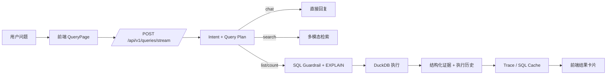

# 智能问数平台

一个把结构化问数、多模态检索、智能标注放在同一套前后端里的桌面型应用仓库。当前代码已经实现：

- 用户登录、工作空间切换与新建
- 数据源与数据集管理
- CSV 导入后加载到 DuckDB 的自然语言查询
- `verified_queries`、`sql_cache`、LLM 多 Agent 的 NL2SQL 规划
- 查询流式反馈、SQL 可编辑重跑、历史记录、Trace 与 LLM 心跳
- 图片/视频离线处理、图片检索、视频片段检索、重排序
- 图片自动标注、视频跟踪标注、图片框选修正、YOLO 标签导出

## 代码现状说明

这份 README 按当前代码实际行为整理，几个重要边界先说明：

- 查询主链路当前真正执行的是 `CSV -> DuckDB`。`MySQL`、`PostgreSQL`、`SQL Server`、`DuckDB` 类型数据源已经支持保存连接信息、连通性测试和 schema 刷新，但还没有接入 `/api/v1/queries` 的实际数据执行。
- 数据集模型里有 `metrics`、`dimensions`、`aliases`、`business_rules` 字段，API 也能写入；但当前前端没有对应编辑界面，NL2SQL 链路也还没有消费这些语义字段。
- 查询页当前是文本查询 UI。后端 `QueryRequest` 已支持 `query_image_path` / `query_video_path`，也实现了“以图搜图/搜视频”的服务逻辑，但前端还没有查询图片/视频上传入口。
- 图片标注支持手工修框与 YOLO 标签导出；视频标注当前只支持自动检测、跟踪预览、统计和下载预览视频，不支持手工框编辑，也不导出 YOLO 标签。
- `deploy/` 下的容器配置仍然更像草稿，不能视为已经打磨完成的生产部署方案。

## 当前功能总览

### 1. 账户与工作空间

- 用户注册、登录、JWT 鉴权
- 登录成功后自动选中用户的第一个工作空间
- 注册时自动创建一个“默认工作空间”
- 支持新建多个工作空间
- 前端侧边栏可随时切换当前工作空间

### 2. 数据源管理

- 支持创建以下类型的数据源记录：
  - `mysql`
  - `postgresql`
  - `sqlserver`
  - `duckdb`
  - `csv`
- 支持数据库连接测试
- 支持 schema 刷新并持久化表结构信息
- 支持 CSV 上传到已有 CSV 数据源，或上传时自动创建新的 CSV 数据源
- 支持列出某个数据源下的 CSV 文件
- 支持删除单个 CSV 文件并自动尝试刷新 schema
- 支持编辑、软删除数据源
- 数据库密码使用 Fernet 加密存储

### 3. 数据集管理

- 数据集支持绑定一个或多个数据源
- 创建数据集时支持混合接入：
  - CSV 上传
  - 图片上传
  - 视频上传
  - 服务端可访问路径
- `file_paths` 既可以是单个文件，也可以是目录；目录会递归扫描支持的图片/视频文件
- 新建包含图片/视频的数据集后，会自动进入异步离线处理队列
- 数据集会维护媒体处理状态：
  - `pending`
  - `processing`
  - `ready`
  - `failed`
- 同时维护处理进度、已处理数量、失败数量、最近处理时间、错误信息
- 删除数据集采用软删除，状态改为 `deprecated`

### 4. CSV 查询链路

- 查询前会把数据集关联的 CSV 文件加载进 DuckDB
- 表名会自动加上数据集作用域前缀，格式为：

```text
ds{dataset_id}_{table_name}
```

- 这样可以避免不同数据集之间同名表相互污染
- CSV 加载包含多轮容错策略：
  - 基于表头探测分隔符
  - 容错模式重试
  - 单列表头异常自愈重载
  - 历史绝对路径迁移修复

### 5. NL2SQL 与查询编排

- 支持四类意图：
  - `chat`
  - `search`
  - `list`
  - `count`
- 意图识别优先走 LLM，失败回退规则
- 支持短会话上下文：
  - 从当前前端会话里提取最近 3 轮有效查询
  - 先由 LLM 判断当前问题是否是追问
  - 若判定为追问，再把上一轮问题拼接成“补充要求”参与规划
- `search` 直接进入多模态检索
- `chat` 直接返回问答文本
- `list` / `count` 的规划优先级为：
  1. `verified_queries.json`
  2. `sql_cache`
  3. LLM 生成 DSL
  4. LLM 基于 DSL 生成 SQL
  5. Reviewer 校验
  6. 自我修正
  7. 失败时返回 `reject`
- LLM 规划链路包含：
  - Intent Agent
  - Coder Agent
  - Reviewer Agent
  - Self-Correction
- 规划结果会回填：
  - `plan_source`
  - `confidence`
  - `candidate_tables`
  - `context_applied`
  - `clarification_needed`
  - `clarification_options`

### 6. SQL 安全与执行

- 仅允许 `SELECT`
- 禁止危险关键词与注释注入
- 禁止堆叠语句
- 支持表白名单校验
- 执行前统一做 DuckDB `EXPLAIN`
- 手工 SQL 会先做：
  - 去注释
  - 反引号转双引号
  - 作用域表名映射
  - 参数清洗
- DuckDB 执行器默认会对无 `LIMIT` 的查询补一个默认限制
- 执行结果会返回：
  - 行数据
  - schema
  - 答案摘要
  - 图表建议
  - 结构化证据
  - 执行历史

### 7. Trace、SQL Cache 与历史

- 每次编排执行都会记录 execution history
- 查询结束后自动写入 `traces.db`
- 成功 SQL 会自动沉淀到 `sql_cache`
- `sql_cache` 命中后仍会再次过安全校验与 `EXPLAIN`
- 失效缓存会自动移除
- 前端在流式查询完成后会额外调用 `/api/v1/history` 写入 `query_histories`
- `/api/v1/queries/{trace_id}/replay` 依赖 `query_histories`，所以只有被记录进历史的查询才能直接回放

### 8. 多模态检索

- 数据集中的图片会被处理为：
  - 缩略预览图
  - embedding
  - caption
  - tags
- 数据集中的视频会被按时间窗口切片，当前默认：
  - `VIDEO_SEGMENT_WINDOW_SEC=8`
  - `VIDEO_SEGMENT_STRIDE_SEC=4`
- 每个视频切片会生成：
  - 关键帧
  - embedding
  - caption
  - tags
- 检索时优先在当前数据集的 `image_indexes` / `video_segment_indexes` 中搜索
- 文本检索和图片检索都支持
- 视频检索结果会合并相邻命中片段，返回时间范围与关键帧预览
- 检索结果会经过 rerank
- 若当前数据集没有媒体索引，会退回旧的 LanceDB 检索路径

### 9. 媒体模型回退机制

- 远程模型可用时，会优先调用：
  - 文本/图片 embedding 服务
  - 视觉大模型 caption 服务
  - reranker 服务
- 远程模型不可用时，会回退到本地确定性特征：
  - 文本 hash embedding
  - 图片颜色/缩略 embedding
  - 基于文件名和主色的 caption
  - 基于关键词命中的 rerank

### 10. 智能标注

- 图片标注：
  - 优先 YOLO 检测
  - 若视觉模型可用，再对裁剪目标做类别细分
  - 生成预览图、描述文本、框列表
- 视频标注：
  - YOLO 逐帧检测
  - 简化卡尔曼 + IoU 跟踪
  - 生成预览视频和 tracking JSON
  - 生成视频场景描述
- 支持会话恢复：
  - 后端会按 `workspace_id + media_type + source_dir` 生成稳定 session id
  - 启动时会自动恢复未完成的标注任务
- 图片标注页支持：
  - 两次点击画框
  - 修改类别
  - 删除单个框
  - 清空全部框
  - 导出单张 YOLO 标签
  - 批量导出全部 YOLO 标签
- 视频标注页支持：
  - 查看跟踪预览视频
  - 下载预览视频
  - 查看跟踪统计

### 11. 前端交互体验

- 查询页使用 SSE 流式展示处理过程
- 每个查询结果都可以显示：
  - 处理进度
  - 意图识别结果
  - 成功/失败状态
  - SQL 编辑器
  - 证据卡片
  - 执行历史卡片
  - 明细表
  - 图表
- 图表支持：
  - 普通 ECharts 柱/线/饼图
  - 排名结果的榜单式展示
- 查询失败且需要澄清时，前端会展示候选表按钮
- 侧边栏每 3 分钟检查一次 LLM 心跳
- 数据集页和查询页都会轮询媒体处理状态

## 当前前端页面

### `/login`

- 用户名密码登录
- 登录后拉取用户信息与工作空间

### `/query`

- 选择当前工作空间下的数据集
- 根据数据集关联数据源加载可选表
- 支持多表勾选
- 支持快捷示例
- 支持短会话追问
- 支持流式查询
- 支持查看并修改生成 SQL 后重跑
- 支持明细/图表切换
- 支持查看 warnings、evidence、execution history、plan_source、confidence

### `/config`

- 查看工作空间下全部数据集
- 新建/编辑/删除数据集
- 内联新建数据库型数据源并绑定到数据集
- 上传 CSV
- 上传图片/视频
- 填写服务端可访问路径
- 展示媒体处理状态和错误

### `/annotation`

- 获取模型可用性与默认目录
- 扫描目录并启动标注
- 自动恢复已有标注会话
- 图片标注修正与导出
- 视频跟踪预览与统计

### `/history`

- 按数据集筛选历史查询
- 展示问题、意图、状态、耗时、Trace ID、时间

### `/settings`

- 查看当前用户信息
- 创建新工作空间

## 查询链路



### `plan_source` 取值

| 值 | 含义 |
| --- | --- |
| `verified_query` | 命中人工维护的可信模板 |
| `sql_cache` | 命中历史成功 SQL 缓存 |
| `llm` | 由 LLM 多 Agent 生成 |
| `manual_sql` | 用户手工 SQL 执行 |
| `reject` | 当前问题被拒绝执行 |

## 多媒体与标注链路

### 媒体数据集处理

1. 新建数据集时上传图片/视频或填入路径
2. 后端创建 `dataset_media_resources`
3. `MediaTaskManager` 异步消费数据集
4. 图片生成 `image_indexes`
5. 视频生成 `video_segment_indexes`
6. 数据集状态更新为 `ready` / `failed`

### 标注任务处理

1. 标注页提交目录扫描请求
2. 后端生成稳定 session 文件
3. `AnnotationTaskManager` 异步处理 session
4. 图片写预览图、结果 JSON、描述
5. 视频写预览视频、tracking JSON、描述
6. 图片可继续手工修正并导出 YOLO 标签

## 目录结构

```text
.
├── backend
│   ├── app
│   │   ├── api                  # 认证、数据源、数据集、查询、历史、监控、标注
│   │   ├── core                 # 配置、数据库、日志、安全
│   │   ├── models               # SQLAlchemy 模型
│   │   ├── schemas              # Pydantic 请求/响应
│   │   ├── services             # NL2SQL、多模态、媒体处理、标注、trace
│   │   ├── orchestrator_*.py    # DuckDB 执行器与 LangGraph 编排
│   │   └── ...
│   ├── data                     # SQLite、DuckDB、上传文件、媒体产物
│   ├── scripts                  # 增量 schema 迁移脚本
│   ├── tests                    # 多媒体与检索测试
│   ├── init_db.py
│   ├── main.py
│   └── requirements.txt
├── frontend
│   ├── src
│   │   ├── api                  # 前端 API 封装与类型
│   │   ├── layouts              # 主布局
│   │   ├── router               # 路由与鉴权守卫
│   │   ├── stores               # Pinia 用户态
│   │   └── views                # login/query/config/history/settings/annotation
│   ├── package.json
│   └── vite.config.ts
├── deploy                       # Docker / nginx 草稿
├── logs                         # start/stop 脚本日志与 pid
├── start.sh
├── stop.sh
└── restart.sh
```

## 快速开始

### 环境要求

- Python `3.10+`
- Node.js `18+`
- `npm`

### 1. 初始化数据库

```bash
cd backend
python init_db.py
```

这一步会：

- 创建业务表
- 补齐媒体相关增量 schema

### 2. 配置环境变量

```bash
cp backend/.env.example backend/.env
```

最小可运行配置：

```dotenv
SECRET_KEY=change-me-in-production

LLM_BASE_URL=https://your-openai-compatible-endpoint
LLM_API_KEY=your-api-key
LLM_MODEL=your-model-name

TRACE_DB_PATH=./data/traces.db
TRACE_FILE_LOG_ENABLED=true
TRACE_LOG_DIR=./logs/traces
```

如果要启用多模态远程模型，再补充：

```dotenv
MEDIA_ENABLE_REMOTE_MODELS=true
VL_BASE_URL=
VL_API_KEY=
VL_MODEL=
EMBEDDING_QWEN_API_URL=
RERANKER_API_URL=
ANNOTATION_YOLO_MODEL_PATH=
```

### 3. 推荐补充的配置

当前代码还有几个值得显式说明的配置点：

| 配置 | 说明 |
| --- | --- |
| `ENCRYPTION_KEY` | 推荐配置。否则数据库连接密码会使用进程内临时密钥加密，重启后旧密码可能无法解密。 |
| `MEDIA_STORAGE_DIR` | 媒体存储根目录，默认 `./data/media` |
| `MEDIA_QUERY_UPLOAD_DIR` | 查询图片/视频路径静态目录，默认 `./data/query_uploads` |
| `MEDIA_TASK_WORKERS` | 媒体离线处理 worker 数 |
| `VIDEO_SEGMENT_WINDOW_SEC` | 视频切片窗口，默认 8 秒 |
| `VIDEO_SEGMENT_STRIDE_SEC` | 视频切片步长，默认 4 秒 |
| `ANNOTATION_STORAGE_DIR` | 标注会话与产物目录，默认 `./data/annotations` |
| `ANNOTATION_TASK_WORKERS` | 标注任务 worker 数 |

### 4. 创建第一个用户

当前前端没有注册页，首次使用请直接调后端注册接口：

```bash
curl -X POST http://localhost:50805/api/v1/auth/register \
  -H "Content-Type: application/json" \
  -d '{
    "username": "admin",
    "password": "change-me-123",
    "email": "admin@example.com",
    "full_name": "Admin"
  }'
```

### 5. 一键启动

```bash
./start.sh
```

脚本会自动：

- 检查 `python` / `pip` / `node` / `npm`
- 按需安装后端依赖
- 按需安装前端依赖
- 启动后端：`50805`
- 启动前端：`50803`
- 写入 `logs/backend.log`、`logs/frontend.log`、PID 文件

访问地址：

- 前端：<http://localhost:50803>
- 后端健康检查：<http://localhost:50805/health>
- Swagger：<http://localhost:50805/docs>

### 6. 关闭与重启

```bash
./stop.sh
./restart.sh
```

## 手动启动

### 后端

```bash
cd backend
python -m pip install -r requirements.txt
python init_db.py
python -m uvicorn main:app --host 0.0.0.0 --port 50805 --reload
```

### 前端

```bash
cd frontend
npm install
npm run dev -- --host 0.0.0.0 --port 50803
```

## API 概览

### 认证与工作空间

- `POST /api/v1/auth/register`
- `POST /api/v1/auth/login`
- `GET /api/v1/auth/me`
- `GET /api/v1/auth/workspaces`
- `POST /api/v1/auth/workspaces`

### 数据源

- `POST /api/v1/data-sources`
- `POST /api/v1/data-sources/upload-csv`
- `GET /api/v1/data-sources`
- `GET /api/v1/data-sources/{data_source_id}`
- `PATCH /api/v1/data-sources/{data_source_id}`
- `DELETE /api/v1/data-sources/{data_source_id}`
- `POST /api/v1/data-sources/test`
- `GET /api/v1/data-sources/{data_source_id}/schema`
- `POST /api/v1/data-sources/{data_source_id}/refresh-schema`
- `GET /api/v1/data-sources/{data_source_id}/csv-files`
- `DELETE /api/v1/data-sources/{data_source_id}/csv-files/{csv_file_id}`

### 数据集

- `POST /api/v1/datasets`
- `GET /api/v1/datasets`
- `GET /api/v1/datasets/{dataset_id}`
- `PATCH /api/v1/datasets/{dataset_id}`
- `DELETE /api/v1/datasets/{dataset_id}`

### 智能标注

- `GET /api/v1/annotations/meta`
- `GET /api/v1/annotations/restore`
- `POST /api/v1/annotations/scan`
- `GET /api/v1/annotations/sessions/{session_id}`
- `PATCH /api/v1/annotations/sessions/{session_id}/cursor`
- `PATCH /api/v1/annotations/sessions/{session_id}/items/{item_id}/annotations`
- `POST /api/v1/annotations/sessions/{session_id}/items/{item_id}/save`
- `POST /api/v1/annotations/sessions/{session_id}/export`
- `GET /api/v1/annotations/sessions/{session_id}/items/{item_id}/file`

### 查询

- `POST /api/v1/queries/stream`
- `POST /api/v1/queries`
- `GET /api/v1/queries/{trace_id}/replay`
- `POST /api/v1/queries/execute-sql`

### 历史与系统

- `POST /api/v1/history`
- `GET /api/v1/history`
- `GET /api/v1/history/{history_id}`
- `GET /api/v1/system/llm-heartbeat`
- `GET /health`

## 数据落盘

| 路径 | 用途 |
| --- | --- |
| `backend/data/chatbot.db` | 业务主库：用户、工作空间、数据源、数据集、历史等 |
| `backend/data/traces.db` | Trace 与 `sql_cache` |
| `backend/data/duckdb.duckdb` | DuckDB 持久化文件 |
| `backend/data/uploads/` | CSV 上传文件 |
| `backend/data/media/` | 图片/视频原始文件与派生关键帧 |
| `backend/data/annotations/` | 标注 session、产物、导出 |
| `logs/` | 启停脚本日志与 pid |
| `backend/logs/traces/` | Trace JSONL 日志 |

后端还会挂载两个静态目录：

- `/media-files`
- `/query-files`

## 测试

仓库内已经包含以下自动化测试：

- 数据集创建与媒体处理流程
- 图片索引与视频切片生成
- 多模态检索结果与 rerank
- 查询接口在媒体处理中返回 warning

运行方式：

```bash
cd backend
pytest tests -q
```

## 当前已知限制

- 远程数据库型数据源当前还没有打通到实际查询执行，查询主链路只消费 CSV。
- `DATABASE_URL` 虽然出现在配置和 `docker-compose.yml` 中，但当前 `app/core/database.py` 仍固定使用 `backend/data/chatbot.db`。
- 前端数据配置页当前只允许在“新建数据集”时接入图片/视频；已有数据集编辑时会阻止追加媒体。
- 查询页还没有图片/视频检索上传入口，只能通过 API 传服务端可访问路径。
- 视频标注不支持手工修框，也不导出 YOLO 标签。
- `verified_queries.json` 默认是空数组，需要人工维护。
- 旧的 LanceDB 检索回退路径依赖额外组件；如果你打算使用这条链路，需要自行检查相关依赖是否安装。
- 智能标注默认目录来自 `backend/app/services/annotation_constants.py` 里的本地路径约定；如果你的机器没有对应目录，需要在页面中手工填写。
- `deploy/` 目录目前仍需整理，不建议直接视为生产部署方案。

## License

当前仓库未声明开源许可证。如需公开分发，请补充 `LICENSE` 文件。
