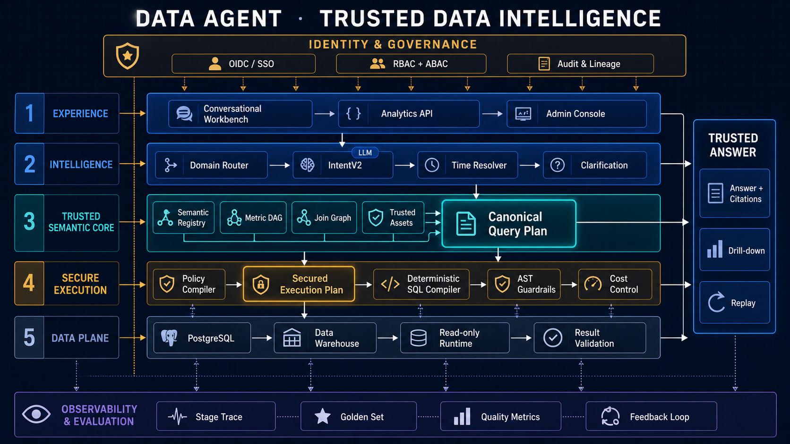

<div align="center">

# Data Agent

### Enterprise Trusted Data Intelligence Agent

**让每个人都能用自然语言安全、准确、可追溯地使用企业数据。**

[](#企业级能力)
[](#为什么可信)
[](#安全与治理)
[](https://www.python.org/)
[](https://fastapi.tiangolo.com/)
[](https://vuejs.org/)
[](https://www.postgresql.org/)

[产品能力](#企业级能力) · [系统架构](#系统架构) · [为什么可信](#为什么可信) · [快速开始](#快速开始) · [API](#api-v2) · [文档](#深入了解)

</div>

Data Agent 是面向企业真实业务场景的数据智能体。它将自然语言理解、业务语义、指标治理、数据权限、确定性查询、可信回答与持续评测整合成一套完整平台，让业务用户直接提问，让数据团队继续掌控口径、安全与质量。

与传统 Text-to-SQL 不同，Data Agent **不让大模型自由生成 SQL**。LLM 只把用户语言转换为受约束的 `IntentV2`；时间、指标、关系、权限和执行预算由确定性系统解析为 `Canonical Query Plan` 与 `Secured Execution Plan`，再编译成可审计 SQL。

> **一个答案，不只有数字。** 每次回答都同时交付指标版本、时间口径、过滤条件、权限影响、数据新鲜度、执行证据和可重放 Trace。

## 为什么选择 Data Agent

| 业务真正关心的 | Data Agent 的回答 |
|---|---|
| **这个数字准不准？** | 指标来自版本化语义模型；聚合、时间口径、Join 基数和指标依赖由确定性计划控制 |
| **为什么是这个数字？** | 回答自带口径、时间、过滤、权限和 freshness 引证，可下钻、可重放 |
| **不同人看到的一样吗？** | OIDC/SSO、租户、RBAC + ABAC、行列权限与数据库 RLS 共同决定每个人的安全视图 |
| **模型升级会不会变差？** | Prompt、模型、语义版本变更自动触发 Golden Set、Holdout 与安全回归评测 |
| **能否接入现有数据平台？** | 支持 PostgreSQL、数据仓库、只读治理账户、OpenAPI 与只读语义 MCP 接口 |
| **能否真正运营？** | Query Run 状态机、SSE、取消、幂等、OpenTelemetry、SLO、审计与质量指标完整覆盖 |

## 产品体验

Data Agent 提供面向业务用户、数据团队和平台管理员的统一工作台：

- **对话式分析**：连续追问、智能澄清、同比环比、趋势、排名、明细与多维下钻；
- **可编辑查询条件**：指标、维度、时间、过滤和排序以结构化 Plan 呈现，可直接调整并重新运行；
- **可信答案卡片**：结论、结果表、假设、警告、引证、导出和反馈归因在同一上下文中完成；
- **语义管理中心**：数据域、指标、字段、词表、关系、版本、审批、Diff、发布和回滚统一治理；
- **Trace 与评测中心**：逐阶段查看意图、计划、安全决策、SQL、成本、结果校验和质量回归。

## 系统架构



架构围绕两个稳定契约展开：

- **Canonical Query Plan** 是与用户权限无关的语义计划，承载指标版本、时间口径、维度、类型化过滤、字段 lineage、假设与澄清证据，可用于缓存、Trusted Asset、回放和评测。
- **Secured Execution Plan** 在 Canonical Plan 上绑定 principal、tenant、policy revision、行列决策、方言、仓库配置与执行预算。语义可以复用，权限结果绝不跨用户共享。

```text
自然语言问题
   ↓
Domain Router → IntentV2 → Time Resolver → Resolve / Clarify
   ↓
Semantic Registry + Metric DAG + Join Graph + Trusted Assets
   ↓
Canonical Query Plan
   ↓
Policy Compiler → Secured Execution Plan
   ↓
Deterministic SQL Compiler → AST Guardrails → Cost Control
   ↓
Read-only Data Runtime → Result Validation
   ↓
Trusted Answer + Citations + Drill-down + Replay
```

整个链路由身份与治理体系向下约束，并由 Stage Trace、Golden Set、质量指标和反馈闭环持续观测。

## 企业级能力

### 1. 可治理的业务语义

- 版本化 **Semantic Registry**：数据域、数据集、实体、字段、指标、词表、策略和关系集中管理；
- 指标携带 owner、版本、单位、精度、time basis、可加性、认证状态和 freshness SLA；
- **Metric DAG** 统一解析复合指标依赖与字段 lineage，编译、权限和引证共享同一事实来源；
- **Join Graph** 显式声明 join key、基数、允许方向与 fanout 策略，杜绝重复计数；
- 枚举别名、多语言词表、有效期和权限范围可治理；
- 发布前自动检查物理契约、循环依赖、单位运算、聚合合法性、时间字段、枚举冲突、Join fanout、策略引用和兼容性 Diff；
- 不可变 Semantic Revision 支持审批、发布、回滚和历史查询复现。

### 2. 受约束的智能理解

- Domain Router 将问题路由到授权的专业数据 Agent，支持多业务域协作；
- `IntentV2` 使用严格 Structured Output，按指标、维度、过滤、时间与歧义分别记录置信度；
- LLM 只理解用户表达，不生成 SQL、不计算日期、不参与授权；
- `Time Resolver` 确定性处理本期、上期、同比、环比、月末、闰年、跨年、时区、DST 与财务日历；
- Typed Filter 对日期、Decimal、枚举、实体和操作符做强类型解析；
- 多轮对话通过结构化槽位继承与 Plan Patch 更新，不依赖无限堆叠聊天记录；
- 歧义、低置信度和策略冲突进入结构化澄清，无法可靠回答的问题明确拒答。

### 3. 确定性查询计划

- 同一 Canonical Plan 在同一语义版本上生成稳定、可比较的 AST；
- 支持聚合、趋势、排名、明细、Top N、多指标、多维分组、同比、环比及受治理 Join；
- 指标允许聚合、比率重算、时间口径和 fixed predicate 都是编译期硬约束；
- 多指标 time basis 不一致时分别规划或触发澄清，不静默共用错误时间字段；
- 方言编译与业务计划分离，可扩展不同数据仓库；
- 查询、Plan、SQL、结果和答案均可结构化 Diff 与重放。

### 4. Trusted Assets

高频、关键和已审核的问题可以沉淀为版本化 Trusted Asset：

- 保存 Canonical Plan 或逻辑语义查询，而不是不可治理的永久物理 SQL；
- 支持触发问题、参数 Schema、语义版本、审核人、审核时间、有效期和验证状态；
- 精确问题、Canonical Signature 与语义检索形成多路召回；
- 命中后仍重新执行时间解析、权限编译、方言编译和安全检查；
- 语义升级、策略变化、数据漂移或过期会自动失效并重新验证；
- 运行时返回命中的资产、验证时间和版本，评测时与答案集严格隔离。

### 5. 可解释回答

每次回答由统一证据模型驱动：

| 证据 | 示例 |
|---|---|
| 指标 | `sales_revenue v3` · 已完成订单含税金额 |
| 时间 | 2026-08-01 ～ 2026-08-31 · 按完成日期 |
| 过滤 | 大区属于华东 · 订单状态为已完成 |
| 权限 | 大区属于华东 · 由数据权限自动附加 |
| 数据 | 最近更新、数据源 revision、是否截断 |
| 计划 | Canonical Plan hash、Trusted Asset、Trace ID |

用户既可以直接使用答案，也可以查看逻辑计划、调整条件、按维度下钻或从原始意图重新执行。

## 为什么可信

### LLM 不写 SQL

模型擅长理解语言，但业务口径、授权和数据执行需要确定性。Data Agent 把模型限制在唯一的意图节点，模型输出还必须通过 Schema、语义引用、策略范围和 Prompt Injection 防护。

### 四层纵深防御

1. **语义可见性**：不可见字段、指标和数据域不进入模型上下文与候选检索；
2. **计划权限编译**：基于字段 lineage 检查 measure、dimension、filter、sort 和 join key；
3. **SQL AST 守卫**：SELECT-only、表/列/函数 Allowlist、无副作用、强制 LIMIT、成本预算；
4. **数据库强制**：独立只读账户、Native RLS / Security Barrier View、Statement Timeout 与资源配额。

### Fail Closed

无法解析权限、无法获得 EXPLAIN、语义版本不兼容、计划超预算、结果异常或证据不完整时，系统选择拒绝、澄清或失败，不返回一个“看起来合理”的数字。

## 安全与治理

- OIDC / OAuth 2.0 Authorization Code + PKCE，支持企业 SSO 与 JWKS 自动轮转；
- 不可变 `PrincipalContext` 统一承载 user、tenant、role、group、attribute 与 auth time；
- RBAC + ABAC、对象级鉴权、租户隔离、列策略 lattice（`DENY > MASK > ALLOW`）与行级策略；
- 管理角色细分为语义查看、编辑、审批、安全管理、Trace 审计和评测运营；
- Prompt、语义描述、枚举、Trusted Asset 和 MCP 内容全部按不可信数据处理；
- Trace 分为 public、user-private、sensitive 与 admin-only，敏感字段按级别脱敏和保留；
- Append-only 审计覆盖语义发布、资产审批、SQL 查看、数据导出、重放与策略变更；
- 基础问数保持只读；深度分析运行在无网络、资源受限、包白名单的 Python Sandbox 中；
- 任何写回、发消息或工单等副作用都需要独立权限、幂等键、预览和人工确认。

## 评测驱动交付

Data Agent 不只评估“模型有没有说对”，而是逐层证明最终数字正确：

| 层级 | 核心评测 |
|---|---|
| Intent | 槽位准确率、歧义召回率、Unsupported 识别 |
| Resolve | 枚举/实体解析、时间区间、假设、澄清 |
| Plan | 指标版本、时间口径、Typed Filter、Join 与 Policy Lineage |
| SQL | AST 性质、表列函数 Allowlist、RLS、LIMIT、方言 |
| Result | 列、行、Decimal 精度、排序、当前期与基期 |
| Answer | 结论、单位、引证完整性、警告与信息泄漏 |
| 非功能 | P50/P95、Token、成本、扫描量、澄清率与拒答率 |

评测数据按用途隔离：

```text
runtime_examples/   # 可用于 Trusted Asset 与运行时示例
holdout/            # CI 盲测，不进入模型上下文
security/           # 越权、注入、枚举探测、跨租户
multiturn/          # 澄清、槽位更新、并发与会话所有权
robustness/         # 错别字、同义改写、长输入、冲突指令
temporal/           # 月末、闰年、跨年、时区、财务日历、DST
```

模型、Prompt、语义与策略每次变更都会产生版本化 Eval Run 和 Regression Report；安全与关键业务集零回归才允许发布。

## 可观测性与 SLO

业务 Trace 和 OpenTelemetry 各司其职：业务 Trace 用于稳定回放与产品解释，OpenTelemetry 用于跨服务监控、告警和性能分析。

每个 Query Run 关联 `request_id / trace_id / run_id / conversation_id / turn_id`，并记录语义版本、策略版本、Prompt 版本、模型快照、Plan hash、SQL hash、Trusted Asset、Token、延迟、EXPLAIN、扫描关系、结果状态和错误分类。

| 指标 | 服务目标 |
|---|---:|
| API 可用性 | 99.9% |
| 基础问数 P95 | < 5 秒 |
| 基础问数 P99 | < 10 秒 |
| 权限策略漏施加 | 0 |
| 元数据持久化成功率 | 99.99% |
| Answered Turn 完整 Trace | > 99.9% |
| 语义版本回滚时间 | < 15 分钟 |

## 工作台与开放接口

- 面向业务用户的对话工作台、结构化澄清、Plan Patch、进度流、取消、重试、下钻和导出；
- 面向数据团队的 Semantic Registry、Metric DAG、Join Graph、Trusted Asset 与 Eval 管理；
- 面向审计人员的权限决策、逻辑计划、物理 SQL、Trace、重放和 Diff；
- OpenAPI 自动生成 TypeScript Client；
- 只读 Governed Semantic MCP Server 允许其他 Agent 在同一语义与权限边界内使用企业数据；
- 可选异步 Worker 支持多步深度分析、图表、受控 Python 计算与结构化报告。

## API v2

创建一次可观测、可取消、幂等的 Query Run：

```bash
curl -X POST http://localhost:8000/api/v2/query-runs \
  -H "Authorization: Bearer $ACCESS_TOKEN" \
  -H "Idempotency-Key: demo-001" \
  -H "Content-Type: application/json" \
  -d '{
    "agent_id": "sales-intelligence",
    "question": "本月华东销售额同比如何？"
  }'
```

```json
{
  "run_id": "qr_01JY8K4M2X",
  "status": "running",
  "events_url": "/api/v2/query-runs/qr_01JY8K4M2X/events"
}
```

```text
POST /api/v2/query-runs
POST /api/v2/query-runs/{run_id}/clarifications
GET  /api/v2/query-runs/{run_id}
GET  /api/v2/query-runs/{run_id}/events
POST /api/v2/query-runs/{run_id}/cancel
GET  /api/v2/conversations/{id}?include=turns,answers
```

所有写请求支持幂等键；会话使用 `state_version` 乐观锁；错误响应返回稳定 `error_code`、安全文案和 `trace_id`。

## 快速开始

### 环境要求

- Python 3.12 / 3.13
- Node.js LTS
- PostgreSQL 14+
- OpenAI 兼容的 Structured Outputs 模型服务

### 启动后端

```bash
cd backend
python -m venv .venv
source .venv/bin/activate
python -m pip install -r requirements.txt

cp .env.example .env
# 配置数据库、OIDC、模型服务和加密密钥

python -m scripts.init_db
uvicorn app.main:app --reload
```

### 启动前端

```bash
cd frontend
npm ci
npm run dev
```

访问 <http://localhost:5173>，API 文档位于 <http://localhost:8000/docs>。

### 质量验证

```bash
# 后端确定性、集成、安全与 Golden 测试
cd backend
python -m pytest -q

# 前端测试与生产构建
cd frontend
npm test
npm run build
```

## 部署架构

Data Agent 采用模块化单体作为在线核心，避免在关键查询链路中引入不必要的网络复杂度；异步评测、深度分析、定时巡检和批量任务由独立 Worker 承载。

```text
                    ┌──────────────────────────────┐
                    │  Load Balancer / API Gateway │
                    └──────────────┬───────────────┘
                                   │
                    ┌──────────────▼───────────────┐
                    │       Data Agent API          │
                    │ Query · Semantic · Auth · Eval│
                    └───────┬──────────────┬────────┘
                            │              │
               ┌────────────▼──────┐  ┌────▼─────────────────┐
               │ Metadata Postgres │  │ Governed Warehouse   │
               │ revisions / audit │  │ read-only + RLS      │
               └────────────┬──────┘  └──────────────────────┘
                            │
               ┌────────────▼──────┐
               │ Redis / Job Queue │
               └────────────┬──────┘
                            │
               ┌────────────▼───────────────────────────────┐
               │ Eval · Deep Analysis · Scheduled Workers   │
               └────────────────────────────────────────────┘
```

当语义服务需要独立 SLA、执行面需要不同网络隔离或在线 Trace 写入量需要独立扩容时，各模块可以沿稳定契约平滑拆分。

## 技术栈

| 层 | 技术 |
|---|---|
| Web | Vue 3 · TypeScript · Pinia · Element Plus · Vite |
| API | FastAPI · Pydantic · SSE · OpenAPI |
| Planning | IntentV2 · Canonical Query Plan · SQLGlot AST |
| Semantic | Semantic Registry · Metric DAG · Join Graph · Trusted Assets |
| Security | OIDC/OAuth2 · RBAC/ABAC · Policy Compiler · Native RLS |
| Data | PostgreSQL · Governed Data Warehouse · Redis（可选） |
| Quality | Pytest · Vitest · Golden Set · Holdout Eval · Security Eval |
| Observability | Structured Trace · OpenTelemetry · SLO Dashboard |
| Extension | Governed MCP · Durable Worker · Restricted Python Sandbox |

## 项目结构

```text
backend/app/
├── api/                # Query Run、会话、语义、评测与 Trace API
├── auth/               # OIDC/JWT、PrincipalContext、RBAC/ABAC
├── workflow/           # Query Run 状态机与阶段接口
├── intent/             # IntentV2 与结构化模型输出
├── temporal/           # 时钟、时区、财务日历与 Time Resolver
├── semantic/           # Registry、Revision、Metric DAG、Join Graph、Lint
├── planning/           # Canonical Query Plan
├── compiler/           # 确定性多方言 SQL 编译
├── security/           # Policy Compiler、AST Guardrails、成本控制
├── execution/          # 只读执行网关与结果验证
├── trusted_assets/     # 可信资产召回、验证与生命周期
├── evals/              # Golden、Holdout、安全和回归评测
└── observability/      # Trace、Replay、Audit 与 OpenTelemetry

frontend/src/
├── features/query-run/       # 问数、澄清、Plan Patch、进度与答案
├── features/conversations/   # 多轮会话与状态恢复
├── features/semantic-admin/  # 语义治理、审批与版本管理
├── features/evals/           # 评测运行与回归报告
└── features/trace/           # 阶段 Trace、SQL、成本与重放
```

## 深入了解

- [可信问数闭环设计](docs/superpowers/specs/2026-08-12-trusted-query-loop-design.md)
- [Golden Set 与评测设计](docs/superpowers/specs/2026-08-12-golden-set-design.md)
- [身份、鉴权与运行时基线](docs/superpowers/specs/2026-08-13-s1-identity-authz-runtime-baseline-design.md)
- [时间语义与 Intent 契约](docs/superpowers/specs/2026-08-13-s2-temporal-intent-contract-design.md)
- [Canonical Plan 与编译器设计](docs/superpowers/specs/2026-08-13-s3-canonical-plan-compiler-design.md)
- [语义注册中心与 Trusted Assets](docs/superpowers/specs/2026-08-13-s4-semantic-registry-trusted-assets-design.md)
- [企业级评测系统](docs/superpowers/specs/2026-08-13-s5-evaluation-system-rebuild-design.md)
- [可观测、缓存与异步执行](docs/superpowers/specs/2026-08-13-s6-observability-cache-async-design.md)
- [API v2 与前端交付](docs/superpowers/specs/2026-08-13-s7-api-v2-frontend-delivery-design.md)
- [完整架构说明](fangan.md)

## 参与贡献

Data Agent 将正确性、安全性和可解释性放在功能数量之前。提交改动时，请说明业务契约、失败边界、权限影响，并为确定性逻辑、安全边界和最终结果补充相应测试或 Golden Case。

我们尤其欢迎以下方向的贡献：

- 新的数据仓库方言与执行适配；
- 行业语义包、指标模板与专业数据 Agent；
- 时间、Join、半可加指标和复杂分析能力；
- 评测数据集、结果等价判定与安全攻击集；
- 可观测性、性能、无障碍和国际化体验。

---

<div align="center">

**Data Agent — from natural language to trusted business decisions.**

</div>
