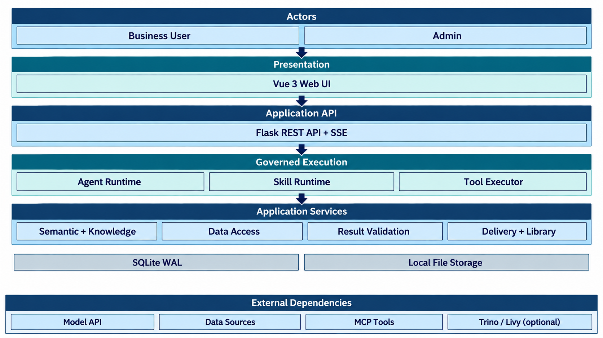
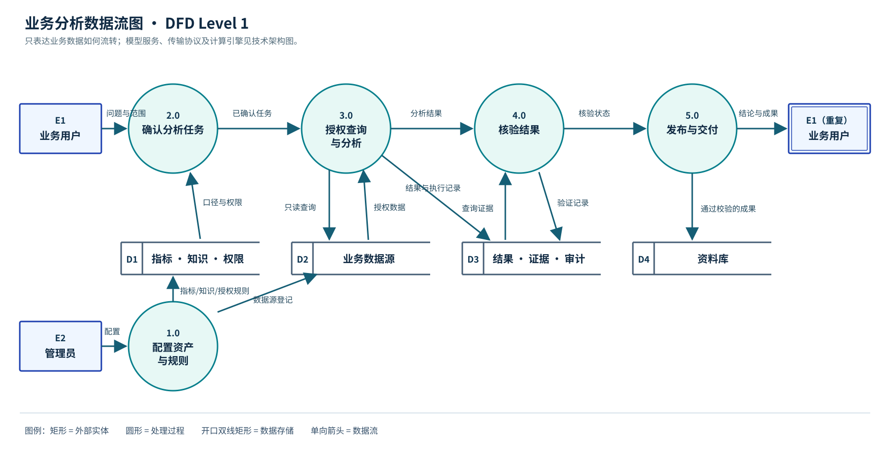

<div align="center">

# 数擎 Data Agent

**面向企业业务人员的可治理、可追溯数据分析智能体**

[](https://github.com/fuyuxiang/data-agent/actions/workflows/ci.yml)


[功能与边界](#核心能力) · [快速开始](#快速开始) · [技术架构](#技术架构) · [业务数据流](#业务数据流) · [部署](#生产部署) · [开发验证](#开发与验证) · [许可状态](#许可与贡献)

</div>

数擎以自然语言为分析入口，在授权的数据范围内调用指标、知识、技能和查询工具，生成可检查的结果与交付物。正式分析结果需要通过发布校验；模型未配置或证据不足时，系统返回明确状态。面向业务人员的产品路径是“提问、确认范围、分析、核验、交付”，管理员负责数据、指标、知识、模型和权限配置。

> **许可状态：**仓库目前没有项目级 LICENSE，且部分分析与清洗代码受第三方非商业条款约束。源码公开可查阅，但当前不能宣称为已按开源许可证发布的项目；复用、分发或商用前请先核实授权，详见[许可与贡献](#许可与贡献)。

产品设计取舍与当前能力边界见[产品边界](PRODUCT_SCOPE.md)。

## 核心能力

| 能力 | 现有实现 |
| --- | --- |
| 工作台与指标中心 | 自然语言入口、推荐问题、指标定义、支持维度与试算；无模型时仍可浏览数据并执行确定性指标查询 |
| 技能与智能体 | 问数、分析、归因、预测、Excel、可视化、深度研究、报告、PPT、导出等 10 个内置技能；智能体组合模型、数据、指标、知识、技能和权限 |
| 外部连接 | OpenAI 兼容模型服务；MCP 工具按风险分级管理；远端 Trino / Livy 适配器为可选能力 |
| 成果交付 | 对通过验证的结果生成文档、PPT、Excel、网页报告或图片，并保存到资料库 |
| 部署 | 当前为单节点私有化形态；上传文件、运行记录与交付物默认存于本机 `storage/`，外部数据源、模型和工具按配置连接 |

### 一次完整的分析如何发生

1. 管理员在「管理后台 → 数据」接入数据库、文件或 API，完成结构预览与访问控制。
2. 管理员在「指标中心」建立语义模型并发布正式指标；在「知识」沉淀业务口径与规则。
3. 管理员在「管理后台 → 技能」调整内置技能或创建企业自己的技能，在「智能体」把它们组合起来。
4. 业务用户在工作台提问；复杂问题先确认口径，再由 Agent 查询、分析并核验。
5. 结果以结论、图表与表格呈现；通过发布校验后生成报告或 PPT，存入资料库。自动核验不替代业务人员对解释和建议的复核。

## 快速开始

### 环境要求

- Python 3.10 或更高版本（CI 使用 Python 3.11）
- Git
- Node.js 20+ 仅在前端检查或生产构建时需要

> [!NOTE]
> SQL Server 连接需要在运行主机上安装 Microsoft ODBC Driver 18。

### 本地 Web 启动

macOS/Linux：

```bash
git clone https://github.com/fuyuxiang/data-agent.git
cd data-agent
python3 -m venv .venv
source .venv/bin/activate
python -m pip install --require-hashes -r requirements.lock
python app.py
```

Windows PowerShell：

```powershell
git clone https://github.com/fuyuxiang/data-agent.git
Set-Location data-agent
py -3 -m venv .venv
& .\.venv\Scripts\Activate.ps1
python -m pip install --require-hashes -r requirements.lock
python app.py
```

启动后默认仅监听 `127.0.0.1:5001`，本机访问 <http://127.0.0.1:5001>。如需供局域网访问，应自行设置 `MERIDIAN_HOST=0.0.0.0`，并配置网络访问控制。开发环境中，全新实例默认进入无账号的本地模式；生产环境会要求先创建第一位系统所有者，密码至少 12 位。

Windows 也可以直接使用项目根目录的脚本启动，不依赖 `.exe` 打包产物：

```powershell
.\start-dataagent.bat
```

脚本会自动创建 `.venv`、安装 Python 依赖、检查或构建前端资源，并默认监听 `127.0.0.1:5001`；如果端口已被占用，会自动选择一个可用端口。需要指定端口时可执行：

```powershell
.\start-dataagent.bat -Port 5010
```

### 首次使用

系统的正确使用顺序是：

1. **连接模型：** 工作空间所有者进入「管理后台 → 模型」，填写 API Key、Base URL 和模型 ID，测试成功后再进行自主分析。
2. **添加数据：** 在「管理后台 → 数据」上传文件或连接数据库；也可以在工作台一键**载入演示数据**。
3. **开始提问：** 回到工作台，用业务语言提问。没有对应指标时 Agent 会自行探索，不会因为缺少指标就拒绝回答。
4. **核对口径：** 对已发布结果查看来源、口径、证据单元格与核验状态，并人工复核业务解释。
5. **产出成果：** 点击「生成报告 / PPT / 导出 Excel」，文件会存进资料库。
6. **扩展能力：** 在「管理后台 → 技能」调整或新建技能，在「智能体」把它们与数据、指标、知识组合起来。

智能体的草稿和发布版本独立保存：编辑、保存或回滚草稿不会影响用户正在使用的发布版本，点击发布后才会切换线上配置。被草稿或当前发布版本引用的知识文档不能删除或停用，需先解除引用并发布修改。

分析可以终止，也可以在结束后移入回收站。外部计算任务只有在确认停止后才显示“已取消”；连接失败时会显示原因并自动重试。删除分析只隐藏原会话中的提问与回答，资料库成果和执行记录继续保留；误删内容可从侧栏「回收站」恢复。回收站沿用原有权限，个人分析仅对本人可见；永久删除需要再次确认。

**演示数据与真实数据的边界：**系统不会自动注入演示销售额或模拟模型回答。只有在工作台点击“使用演示数据”或显式调用 `POST /api/demo/seed` 后，才会创建一套以载入当月为终点的 24 个月**合成**零售销售事实表（区域 × 城市 × 品类 × 渠道）、8 个正式指标和 4 条业务知识。它仅用于体验产品，不代表真实企业业绩。同一月份首次载入的数据可复现；新工作空间在不同月份首次载入时，时间窗口会随之移动，已有工作空间重复载入不会改写数据。可用以下问题检验演示链路：

```text
本月销售额是多少？
华东销售同比怎么样？
哪个城市下降最多？
为什么华东销售下降？
哪些商品表现异常？
预测下个月销售额。
生成经营分析报告。
生成经营分析 PPT。
```

合成数据中的华东最近几个月设有同比下滑，且可按品类与渠道定位变化贡献；这支持展示归因分析流程，不能据此宣称已识别真实经营因果。

### 可选：深度学习能力

基础依赖不强制安装 PyTorch。需要 Torch MLP 或 GRU 时，请根据本机 CPU/CUDA 环境选择合适的 PyTorch wheel，然后安装：

```bash
python -m pip install -r requirements-dl.txt
```

## 技术架构



图为**分层组件视图**：箭头表示主要调用层次，不表示层内每个组件都依次执行。当前交付形态是一个 Flask 应用节点，控制数据写入 SQLite WAL，上传文件、索引和交付物保存在本地文件目录；模型服务、业务数据源与 MCP 工具按配置连接。Trino 和 Livy 是可选的远端计算适配器，图中不代表仓库自带集群。

| 层 | 源码位置 | 职责 |
| --- | --- | --- |
| 表现层 | [frontend/src](frontend/src) | Vue 3 页面、对话工作台、管理后台、结果展示 |
| API 层 | [backend/api](backend/api) | HTTP 接口、访问边界、SSE 事件 |
| 执行层 | [backend/agent](backend/agent)、[backend/skills](backend/skills) | 单一 Agent 循环、任务契约、技能解析与受治理的工具执行 |
| 业务服务层 | [backend/services](backend/services) | 指标语义、知识、数据访问、验证、交付、MCP |
| 数据访问层 | [backend/services/data_plane](backend/services/data_plane) | 有界本地分析、Trino 与 Livy 适配、数据引用与执行路由 |
| 持久化层 | [backend/core](backend/core) | SQLite 元数据、实例锁、配置与运行观测 |

模型调用由 Agent 运行时发起；MCP 调用经过受治理工具层；数据访问受来源授权及只读 SQL 约束。正式结果由[发布门禁](backend/services/results/manifests.py)检查数据完整性、验证状态与显式数字的证据引用，再写入资料库。核验通过仅表示既定规则已通过，不能证明业务因果解释必然正确。

### 技术栈

- **Web 客户端：** Vue 3 Global Build + 原生 ES Modules，ECharts、Marked 和 DOMPurify 随项目本地交付，无运行时 CDN 依赖。使用已构建的静态资源运行时不需要 Node 工具链。
- **API 与运行时：** Flask + Waitress；正式分析由独立 Run/Contract/Plan/Action/Event API 驱动，SSE 可重连补事件。
- **Skill Runtime：** `backend/skills/` 独立包，负责发现、解析、权限过滤与执行准备；不自己跑循环，而是收窄既有的受治理 Agent 循环。
- **数据与计算：** pandas、DuckDB、SQLAlchemy、SciPy、scikit-learn、statsmodels、pmdarima；PyTorch 为可选能力。
- **元数据库：** 单机 SQLite WAL，保存用户、工作空间、会话、配置、任务、血缘和审计记录。
- **交付：** openpyxl、python-docx、python-pptx，以及经核验结果的图表与网页报告。

### 核心目录

```text
.
├── app.py                       # 应用入口；默认使用 Waitress
├── backend/
│   ├── api/                     # HTTP/SSE 接口与边界校验
│   ├── core/                    # 配置、SQLite 存储、观测性和实例锁
│   ├── agent/                   # 唯一模型协议、AgentLoop、RunStore 与 ToolExecutor
│   ├── skills/                  # Skill 运行时：registry / loader / resolver / executor
│   ├── services/                # 数据面、验证、结果、MCP 与交付服务
│   │   └── results/             # 正式成果验证与交付
│   ├── analysis_modules/        # 统计、机器学习与时序分析实现
│   └── data_cleaning/           # 可追溯的数据处理能力
├── frontend/src/
│   ├── components/              # 统一基础组件、图标、图表、执行状态、结果区块
│   ├── views/                   # 用户端与后台页面
│   ├── styles/                  # 设计令牌与分层样式
│   ├── store.js / router.js     # 全局状态与信息架构
├── skills/                      # 内置 Skill 包（SKILL.md + manifest.yaml）
├── scripts/                     # 构建、前端检查、UI 验证、仓库审计、备份与恢复
├── tests/                       # API、安全、Skill 运行时、演示数据与浏览器测试
├── storage/                     # 本地运行数据（不纳入 Git）
└── docs/                        # 技术架构图与业务数据流图
```

## 业务数据流



这是一张 **DFD Level 1**：矩形是外部实体，圆形是处理过程，开口双线矩形是数据存储，单向箭头标注实际传递的数据。右侧重复绘制业务用户 E1 以避免返回箭头穿过处理过程；它与左侧 E1 是同一角色。

1. 管理员配置数据源、正式指标、业务知识和授权规则，形成 D1、D2 的输入。
2. 业务用户提交问题与数据范围，系统确认任务；随后在授权范围内查询 D2，并结合 D1 的口径开展分析。
3. 查询结果和执行记录进入 D3，核验过程读取证据并写回验证记录。
4. 已验证结果才进入正式成果发布路径；业务用户获得结论与交付物，资料库存放通过校验的成果。

图侧重**业务数据流**，把模型调用封装在 3.0“授权查询与分析”之内；外部模型服务及其部署关系见上方技术架构图。失败或证据不足时，运行记录和失败状态仍可查看，但不会生成经发布门禁认可的正式分析成果。

## 配置

完整模板见 [`.env.example`](.env.example)。本机开发可以使用默认值；生产环境必须显式注入密钥和信任边界。

> [!IMPORTANT]
> `app.py` 不会自动加载 `.env` 文件。请通过 Shell、进程管理器或密钥管理服务注入环境变量。

| 变量 | 默认值 | 说明 |
| --- | --- | --- |
| `MERIDIAN_ENV` | `development` | `development` / `production` / `test` |
| `MERIDIAN_HOST` / `MERIDIAN_PORT` | `127.0.0.1` / `5001` | HTTP 监听地址与端口 |
| `MERIDIAN_STORAGE_DIR` | `./storage` | SQLite、上传文件、知识、交付物和回收站根目录 |
| `MERIDIAN_SECRET_KEY` | 开发环境自动生成 | 会话签名密钥；生产环境至少 32 字符 |
| `MERIDIAN_ENCRYPTION_KEY` | 开发环境复用会话密钥 | 外部凭据静态加密密钥；生产必须独立持久化 |
| `MERIDIAN_BACKUP_KEY` | 空 | 备份加密密钥；生产必须与前两个密钥不同 |
| `MERIDIAN_BOOTSTRAP_TOKEN` | 空 | 生产首位系统所有者的一次性初始化令牌，至少 32 字符 |
| `MERIDIAN_METRICS_TOKEN` | 空 | Prometheus `/api/metrics` Bearer Token；生产必须至少 32 字符 |
| `MERIDIAN_TRUSTED_HOSTS` | 空 | 允许访问应用的 Host；生产必填 |
| `MERIDIAN_ALLOWED_ORIGINS` | 本机开发地址 | 允许携带凭据调用 API 的 Origin |
| `MERIDIAN_OUTBOUND_HOST_ALLOWLIST` | 空 | 模型、MCP、HTTP 数据源、Webhook 等出站目标域名；生产必填 |
| `MERIDIAN_DATABASE_HOST_ALLOWLIST` | 空 | 允许登记的外部数据库域名 |
| `MERIDIAN_ALLOW_PRIVATE_NETWORK` | `0` | 是否允许一般 HTTP 出站访问内网地址 |
| `MERIDIAN_DATABASE_ALLOW_PRIVATE_NETWORK` | 开发 `1` / 生产 `0` | 是否允许数据库连接访问本机或内网地址；可用 `0`/`1` 显式覆盖 |
| `MERIDIAN_COOKIE_SECURE` | 生产为 `1` | 仅允许在 HTTPS 上发送会话 Cookie |
| `MERIDIAN_MAX_UPLOAD_MB` | `100` | 单次上传大小上限 |
| `MERIDIAN_MAX_QUERY_ROWS` | `10000` | 服务端查询结果行上限 |
| `MERIDIAN_MAX_QUERY_MB` | `20` | 单次查询物化结果的编码/内存字节上限（MB） |
| `MERIDIAN_MAX_QUERY_CELL_KB` | `1024` | 单个字符串或二进制结果单元格上限（KB） |
| `MERIDIAN_QUERY_TIMEOUT_SECONDS` | `30` | 外部数据库查询超时 |
| `MERIDIAN_DAILY_TOKEN_LIMIT` | `5000000` | 每工作空间每日模型 token 配额 |
| `MERIDIAN_LOCAL_ANALYSIS_TIMEOUT_SECONDS` | `120` | 固定审核分析方法的子进程超时秒数；不执行生成的 Python 代码 |
| `OPENAI_API_KEY` / `OPENAI_BASE_URL` / `OPENAI_MODEL` | 参见模板 | 可选的环境级 OpenAI-Compatible 默认服务 |

与资源边界相关的行数、单元格数、分析规模、Agent 迭代、任务队列、会话时长、SMTP 和嵌入模型变量，请直接查看 [`.env.example`](.env.example)。

## 生产部署

在运行主机上安装 Python 依赖并构建前端，然后至少配置以下环境变量：

```bash
python3 -m venv .venv
source .venv/bin/activate
python -m pip install --require-hashes -r requirements.lock
npm ci
npm run check
npm run build

export MERIDIAN_ENV=production
export MERIDIAN_FRONTEND_DIR="$PWD/frontend/dist"
export MERIDIAN_SECRET_KEY="$(openssl rand -hex 32)"
export MERIDIAN_ENCRYPTION_KEY="$(openssl rand -hex 32)"
export MERIDIAN_BACKUP_KEY="$(openssl rand -hex 32)"
export MERIDIAN_BOOTSTRAP_TOKEN="$(openssl rand -hex 32)"
export MERIDIAN_METRICS_TOKEN="$(openssl rand -hex 32)"
export MERIDIAN_TRUSTED_HOSTS="analytics.example.com"
export MERIDIAN_ALLOWED_ORIGINS="https://analytics.example.com"
export MERIDIAN_OUTBOUND_HOST_ALLOWLIST="api.openai.com"
python app.py
```

启动后可从另一个终端执行 `curl --fail http://127.0.0.1:5001/api/health`。默认仅监听 `127.0.0.1`。首次打开页面时还必须输入部署时生成的 `MERIDIAN_BOOTSTRAP_TOKEN`；创建首位所有者后注册入口自动关闭。请在前方配置 HTTPS 反向代理，并将对外域名精确写入 `MERIDIAN_TRUSTED_HOSTS` 和 `MERIDIAN_ALLOWED_ORIGINS`。所有实际使用的模型、MCP、HTTP 数据源和通知服务域名都应纳入出站白名单。

`app.py` 在非 debug 模式下使用 Waitress。生产环境禁止启用 `MERIDIAN_DEBUG=1`，且会拒绝不完整的前端产物或弱密钥配置。有界分析以本地子进程执行固定审核方法；生成的任意 Python 代码会被拒绝。生产部署还应使用专用低权限系统账号和进程管理器。

### 运行边界

> [!WARNING]
> 当前生产形态是**单节点**：控制面使用 SQLite，进程会对 `storage/.instance.lock` 加独占锁。不要将多个应用副本指向同一个 `storage` 目录。如需多副本高可用，必须先将控制面、任务队列和文件存储迁移到可共享的外部服务。

### 健康检查

- `GET /api/health`：进程与数据库基础健康状态。
- `GET /api/ready`：业务就绪检查；生产环境在所有者、模型和本地审核分析能力任一未就绪时返回 503，并列出缺失项。

## 备份与恢复

备份工具会使用 SQLite Online Backup API 创建一致性快照，连同上传文件、知识和交付物归档；设置 `MERIDIAN_BACKUP_KEY` 后使用 AES-GCM 加密并输出 SHA-256。

```bash
export MERIDIAN_BACKUP_KEY="<与应用密钥分离保管的至少-32-字符密钥>"
python scripts/backup.py --storage storage
```

恢复时应先停止应用，将备份验证并解包到一个**空目录**：

```bash
python scripts/restore.py storage/backups/meridian-YYYYMMDDTHHMMSSZ.tar.gz.enc \
  --destination /path/to/empty-restore-root \
  --sha256 <backup-sha256>
```

恢复命令会拒绝路径越界、链接或非法归档成员，并对数据库执行 `PRAGMA integrity_check`。验证通过后，再由运维流程将 `<destination>/storage` 替换为实际数据目录。

## 开发与验证

### 安装开发依赖

```bash
python3 -m venv .venv
source .venv/bin/activate
python -m pip install --require-hashes -r requirements-dev.lock
```

`requirements-dev.in` 保存直接开发依赖，`requirements-dev.txt` 是兼容安装入口。修改 `.in` 后使用
`requirements-dev.lock` 文件头记录的命令重新生成锁文件。

### 后端质量检查

```bash
ruff check backend scripts tests app.py
ruff check --select S backend scripts app.py
python -m compileall -q backend scripts app.py
pytest -q -m "not database_integration" \
  --cov=backend/agent --cov=backend/api --cov=backend/core --cov=backend/services \
  --cov-report=term --cov-fail-under=60
coverage report --include='backend/agent/*' --fail-under=85
pip-audit -r requirements.lock --no-deps --disable-pip
```

### 前端检查与构建

```bash
npm ci
npx playwright install chromium
npm audit --audit-level=high
npm run check
npm run build
npm run test:browser
```

`npm run check` 会验证本地前端依赖完整性和 JavaScript 语法；`npm run build` 会生成不包含开发时动态模板编译器的 `frontend/dist/` 生产静态资产。完整产品仍需要 Python API 服务。

### 集成测试

PostgreSQL 和 MySQL 连接器测试需要临时数据库，环境变量与执行方式可参考 [`.github/workflows/ci.yml`](.github/workflows/ci.yml)。CI 还会执行覆盖率门槛、锁定依赖安全审计、本地审核分析和浏览器测试。

当前版本按验证场景生成可重现的结果，不再使用从已缺失旧规范自动填入 `IMPLEMENTED` 的验收矩阵。运行以下 profile，分别检查本地代码及需要真实外部环境的能力：

```bash
python scripts/verify_advanced_agent.py --profile ci
python scripts/verify_advanced_agent.py --profile repository-audit
python scripts/verify_advanced_agent.py --profile warehouse-reference
python scripts/verify_advanced_agent.py --profile target-platform
python scripts/verify_advanced_agent.py --profile scale
python scripts/verify_advanced_agent.py --profile live-model
python scripts/verify_advanced_agent.py --profile notification
python scripts/verify_advanced_agent.py --profile migration-restore
python scripts/verify_advanced_agent.py --profile release
```

缺少真实模型、集群、SMTP、迁移、目标平台或规模证据时，相应 profile 返回 `BLOCKED` 和非零状态，不会把“未执行”写成 PASS。

## 安全边界

系统将“分析可用”和“默认安全”同时作为设计约束：

- **SQL 只读：** 使用 sqlglot 解析单条 `SELECT` / `WITH` / 集合查询，禁止 DDL/DML、外部文件/网络函数和多语句；同时在数据库会话层启用只读事务、超时和行数上限。
- **数据不覆盖：** 清洗结果作为新派生数据集保存；常规删除进入可恢复的归档/回收站，永久删除需显式确认。
- **秘密保护：** 模型、数据源、MCP 和通知凭据使用应用主密钥加密落库，API 只返回脱敏状态。
- **出站防护：** 外部 HTTP 请求校验 scheme、域名白名单和解析后 IP，默认禁止本机、内网、链路本地与保留地址，并限制重定向和响应体大小。
- **身份与隔离：** 生产环境强制登录，首位所有者需初始化令牌；工作空间角色、数据源成员白名单和私有会话所有权同时生效，且结果、任务、快照与导出会重新检查当前数据授权；写请求受 Origin 和 CSRF 校验保护。
- **受控执行：** stdio MCP 默认关闭；Agent 不具备宿主写改删、Shell/Git、自改 Hook 或任意远程代码能力；有界分析仅运行固定审核方法，并对输入、输出和执行时间设限。
- **可追溯：** 查询、分析、工具调用、快照恢复和交付动作保留审计证据。

安全控制不代替部署环境的 TLS、网络分区、最小权限数据库账号、密钥托管、异地备份和安全监控。生产上线前应根据组织的数据分类分级和合规要求完成独立评审。

## 许可与贡献

- `storage/`、`.env`、本地数据库、日志和构建产物已通过 `.gitignore` 排除；请勿将真实数据、密钥或备份提交到 Git。
- 依赖版本由 `requirements.lock` 以哈希锁定，生产环境使用 `--require-hashes` 安装。
- 当前仓库**没有项目级 `LICENSE`**。权利人尚未授予明确的开源使用、修改和分发许可，不应仅因源码可见就视为可自由复用的开源软件。
- `backend/analysis_modules/` 和 `backend/data_cleaning/` 含有受非商业条款约束的第三方或同源代码；企业内部商用、对外分发和二次销售均须先解决授权或独立替换问题。详见 [`THIRD_PARTY_NOTICES.md`](THIRD_PARTY_NOTICES.md)。
- 可通过 Issue 提交可复现的问题与改进建议。接受代码贡献及选择项目级许可证，需要项目权利人先明确贡献和授权规则。

---

<div align="center">

**数擎 Data Agent · 让分析结果可复核。**

</div>
